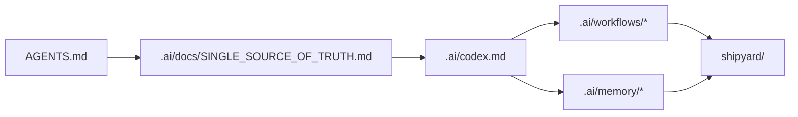

# AI Harness

`.ai/` is the checked-in helper harness for the Shipyard workspace. It is not
product code. It holds the reusable instructions, workflows, memory scaffolds,
and templates used while building the actual application in `shipyard/`.

## Directory Map

- [`codex.md`](./codex.md): canonical Codex orchestrator for this workspace
- [`docs/README.md`](./docs/README.md): durable harness docs and reference index
- [`memory/README.md`](./memory/README.md): durable versus session memory layout
- [`workflows/README.md`](./workflows/README.md): execution playbooks and finish flows
- [`agents/README.md`](./agents/README.md): compatibility mirrors and agent-role prompts
- [`skills/README.md`](./skills/README.md): local skill inventory and guidance
- [`templates/README.md`](./templates/README.md): scaffolds for spec-driven work
- [`state/README.md`](./state/README.md): runtime support state for the harness itself

## Harness Boundary

- Keep `.ai/` generic to this repository.
- Do not move product features or runtime implementation into this directory.
- Treat `shipyard/` as the only runnable application surface.

## Diagram

