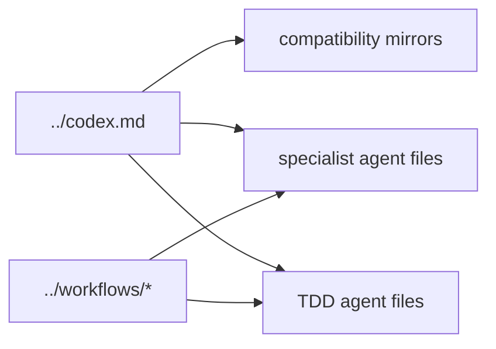

# Agent Files

This directory holds compatibility mirrors, role-specific prompts, and example
agent definitions used by the harness.

## Current Files

- `claude.md` and `cursor-agent.md`: compatibility-oriented agent entry docs
- `architect-agent.md`, `deployment-agent.md`, `security-agent.md`: specialist
  prompt files
- `tdd-agent.md`, `tdd-implementer.md`, `tdd-reviewer.md`,
  `tdd-spec-interpreter.md`: TDD-oriented role files
- `domain-agent-example.md` and `specialist-agent-example.md`: examples for
  role-specific extensions

## Diagram

