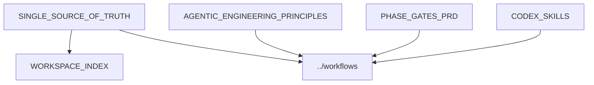

# Harness Docs

This folder holds the durable reference docs for the helper harness.

## Notable Files

- `SINGLE_SOURCE_OF_TRUTH.md`: canonical workspace baseline and guardrails
- `WORKSPACE_INDEX.md`: broader orientation material
- `AGENTIC_ENGINEERING_PRINCIPLES.md`: working principles for agentic delivery
- `PHASE_GATES_PRD.md`: phased quality and release gate framing
- `CODEX_SKILLS.md`: local skill usage notes
- `design/`: UI-facing design references used by workflow guidance
- `references/` and `research/`: supplemental material

## Diagram

