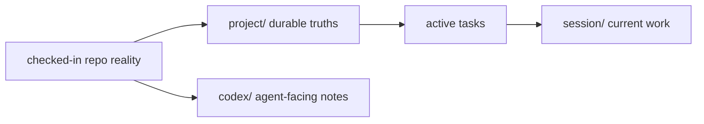

# Harness Memory

The harness memory tree separates durable repository truths from per-session
working context.

## Layout

- `project/`: durable architecture, patterns, and anti-patterns
- `session/`: current-task notes and decisions
- `codex/`: Codex-facing memory and reminders

## Rules

- Put long-lived repo facts in `project/`.
- Put active-task notes in `session/`.
- Keep memory aligned with the actual checked-in code and docs instead of
  carrying stale chat assumptions forward.

## Diagram

