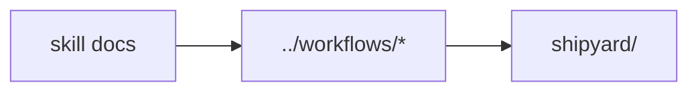

# Harness Skills

This directory holds checked-in skill references used by the local harness.

## Current Skill Notes

- `code-standards.md`
- `frontend-design.md`
- `performance-checklist.md`
- `refactoring-guide.md`
- `security-checklist.md`
- `spec-driven-development.md`
- `tdd-workflow.md`
- `testing-pyramid.md`
- `software-factory/README.md`

## Diagram

