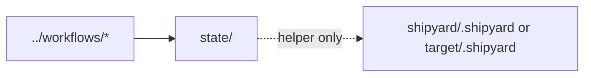

# Harness State

This directory holds helper-harness runtime state rather than product runtime
state.

## Current Contents

- `flight-board.json`: lightweight state snapshot for ongoing work
- `tdd-handoff/README.md`: handoff support for TDD workflow coordination

## Boundary

- Use this folder for harness support state only.
- Product runtime state belongs under `shipyard/.shipyard/` or the active
  target repository, not here.

## Diagram

