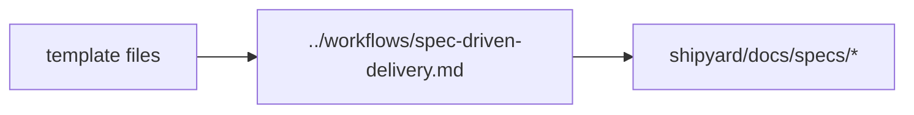

# Templates

This directory contains scaffolds used by spec-driven delivery workflows.

## Current Template Area

- `spec/README.md`: template pack overview
- `spec/*_TEMPLATE.md`: feature spec, technical plan, task breakdown,
  constitution check, and UI-specific templates

## Diagram

