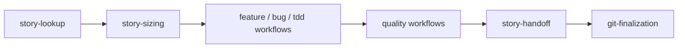

# Workflows

This folder contains the repeatable playbooks the harness uses to route work.

## Major Workflow Groups

- story discovery and sizing: `story-lookup.md`, `story-sizing.md`
- implementation: `feature-development.md`, `bug-fixing.md`, `tdd-pipeline.md`
- review and quality: `security-review.md`, `performance-optimization.md`,
  `ui-qa-critic.md`
- finalization: `story-handoff.md`, `git-finalization.md`,
  `finalization-recovery.md`
- special routing: `ai-architecture-change.md`, `deployment-setup.md`

## Diagram

