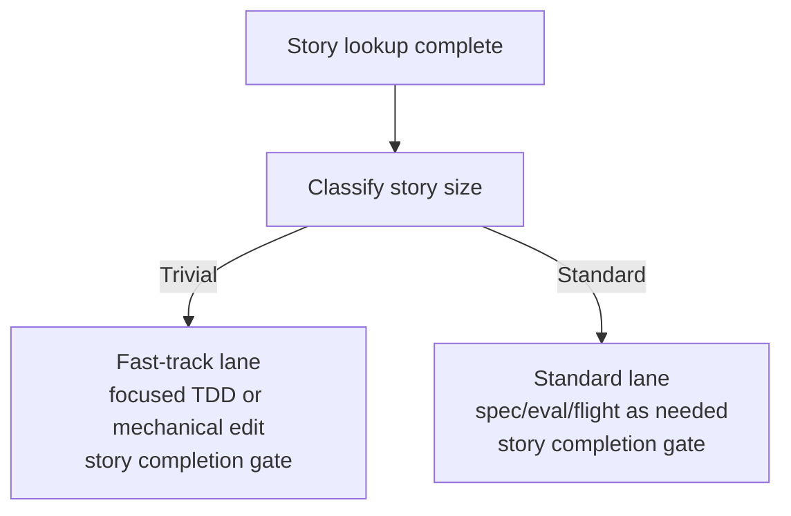

# Story Sizing Workflow

**Purpose**: Classify a story after lookup so trivial changes use a proportionate fast-track lane and everything else uses the standard lifecycle.

---

## When To Run

Run this after `.ai/workflows/story-lookup.md` and before:
- `.ai/workflows/spec-driven-delivery.md`
- `.ai/workflows/eval-driven-development.md`
- `.ai/workflows/parallel-flight.md`

---

## Lifecycle Routing

---

## Step 1: Apply the Trivial Classifier

A story is `trivial` only when **all** of these are true:
- the intended change is bounded to one file,
- no API surface or public contract changes,
- no AI behavior changes,
- no schema, migration, deployment, or config contract changes,
- no new dependency or tooling introduction,
- no architecture/doc workflow changes beyond one directly affected surface.

If any condition fails, classify the story as `standard`.

---

## Step 2: Publish the Lane Decision

State explicitly:
- `lane: trivial` or `lane: standard`
- why the story did or did not qualify
- which gates will be skipped or still required

---

## Step 3: Route the Story

### If `trivial`
- skip `.ai/workflows/spec-driven-delivery.md`
- skip `.ai/workflows/eval-driven-development.md`
- skip `.ai/workflows/parallel-flight.md`
- go directly to focused TDD if code behavior changes, then to `.ai/workflows/story-handoff.md`

### If `standard`
- continue through the normal task workflow and required gates

---

## Exit Criteria

- lane classification recorded
- trivial lane used only when all classifier conditions passed
- skipped gates called out explicitly
