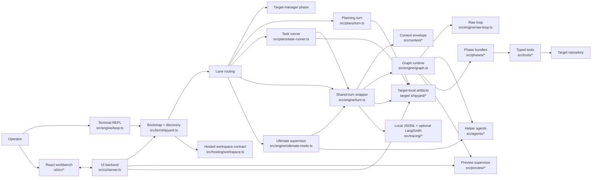
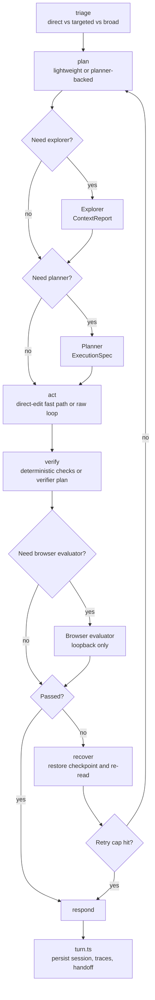
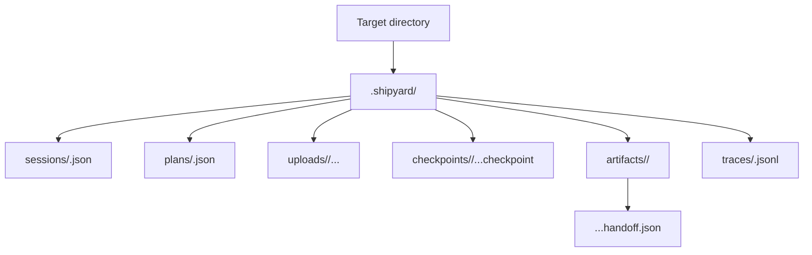

# Shipyard CODEAGENT

Shipyard is no longer a "submission appendix." It is a persistent coding-agent
runtime with one shared execution core, two operator surfaces, multiple routed
turn lanes, and a deliberately strict safety model around edits, verification,
preview, deployment, and continuation.

This file is the implementation contract for people extending Shipyard. Read it
when you need the architectural model behind `src/`, the browser workbench in
`ui/`, or the target-local runtime state written under `.shipyard/`.

## Architectural Thesis

The system's main trick is not hidden magic. It is stubborn coherence:

- one shared turn engine for terminal and browser operation
- one target-local runtime state tree instead of scattered temp files
- one write authority, with helper roles kept read-only and report-based
- one typed tool surface instead of ad hoc shell access leaking into prompts
- one explicit runtime graph that makes planning, verification, recovery, and
  continuation visible instead of implicit

That coherence is what lets Shipyard keep adding surfaces and capabilities
without becoming a bag of one-off agent loops.

## At A Glance

- Two operator surfaces:
  - terminal REPL via [`src/engine/loop.ts`](./src/engine/loop.ts)
  - browser workbench via [`src/ui/server.ts`](./src/ui/server.ts) and
    [`ui/src/*`](./ui/src)
- Three primary turn lanes:
  - target-manager turns before a concrete target is selected
  - planning turns for `plan:` plus queued-task execution via `next` and
    `continue`
  - standard code turns through the graph runtime with raw fallback parity
- One supervisory overlay:
  - `ultimate ...` loops that alternate between the human-simulator and the
    shared standard turn executor
- One long-run operations layer:
  - mission-control recovery for stale-heartbeat relaunches
  - release archiving on preview refresh so live targets can be rolled back
  - optional scheduled deploy sync that consumes archived target state without
    changing the core turn graph
- Current shipped model default:
  - Anthropic via `claude-opus-4-6`
- Current public deploy path:
  - Vercel through `deploy_target`, with deterministic target-local Vercel
    project links and public-by-default production URLs

## System Topology

## Architectural Bets That Paid Off

| Bet | Why it matters now |
| --- | --- |
| One shared turn wrapper | Terminal mode, browser mode, queued-task execution, and `ultimate` all reuse the same execution contract instead of drifting into separate agent semantics. |
| Single-writer coordinator | Exploration, planning, verification, browser evaluation, and simulation can grow independently without creating multi-writer merge chaos. |
| Typed tools as the model boundary | File IO, spec loading, commands, deploys, target creation, and enrichment remain inspectable, testable, and phase-gated. |
| Target-local `.shipyard/` state | Sessions, plans, uploads, checkpoints, traces, handoffs, and deploy context travel with the target instead of hiding in process memory. |
| Graph runtime plus raw fallback parity | The happy path gets explicit routing and recovery, while the raw loop remains the escape hatch and the reusable primitive for helper agents. |
| Loopback preview, explicit deploy | Preview supervision stays local and disposable; public URLs come from `deploy_target`, which avoids confusing preview infrastructure with production hosting. |
| Provider-neutral model adapters | Anthropic is the shipped default, but route-specific provider/model overrides do not leak SDK wire types into the rest of the runtime. |

## Bootstrap And Lane Selection

[`src/bin/shipyard.ts`](./src/bin/shipyard.ts) is the startup contract.

It is responsible for:

- resolving `--target` versus `--targets-dir`
- preparing the hosted workspace contract when Shipyard is running in a hosted
  environment
- discovering the selected target or synthesizing a target-manager discovery
  report when no target has been chosen yet
- loading the saved session or creating a new one
- loading target `AGENTS.md` rules when a concrete target exists
- selecting terminal REPL mode or browser `--ui` mode
- handling UI startup details like session labels, workspace paths, and port
  collision reporting

### Turn lanes

| Lane | Entrypoint | Purpose | Writes? |
| --- | --- | --- | --- |
| Target manager | [`src/phases/target-manager`](./src/phases/target-manager) via [`src/engine/turn.ts`](./src/engine/turn.ts) | list, select, create, bootstrap, and enrich targets before coding begins | yes, but only through target-manager tools |
| Planning | [`src/plans/turn.ts`](./src/plans/turn.ts) | build a persisted, reviewable task queue from `plan:` instructions | no |
| Task runner | [`src/plans/task-runner.ts`](./src/plans/task-runner.ts) | reload the active plan and execute one queued task via `next` or `continue` | yes |
| Standard turn | [`src/engine/turn.ts`](./src/engine/turn.ts) | the main code or target-manager instruction path | yes |
| Ultimate supervisor | [`src/engine/ultimate-mode.ts`](./src/engine/ultimate-mode.ts) | repeatedly run a shared turn, then ask the human-simulator whether to continue | yes, through the shared standard turn |

`ultimate` is not a second runtime. It is a long-lived controller layered on
top of the normal turn executor.

## Phase Model And Context Envelope

Phases are explicit capability bundles, not prompt folklore.

- [`src/phases/code`](./src/phases/code) is the normal repository-change phase
- [`src/phases/target-manager`](./src/phases/target-manager) is the pre-code
  phase for project selection, creation, enrichment, and bootstrap
- planning reuses the current phase context, but remains read-only

The context layer in [`src/context/envelope.ts`](./src/context/envelope.ts)
builds four slices:

- `stable`
  - discovery report
  - target `AGENTS.md` rules
  - available scripts
- `task`
  - current instruction
  - injected context
  - target file hints
- `runtime`
  - recent tool outputs
  - recent errors
  - current git diff
  - feature flags
- `session`
  - rolling summary
  - retry counts by file
  - blocked files
  - recent touched files
  - latest loaded handoff
  - active task context

This is one of the core architectural moves in Shipyard: repository discovery,
project rules, runtime evidence, and active work state are all serialized into
an explicit envelope instead of being implied by recent chat.

## Graph Runtime

The graph runtime in [`src/engine/graph.ts`](./src/engine/graph.ts) is the
source of truth for standard code turns.

### What the nodes do

- `triage`
  - classifies the work as `direct`, `targeted`, or `broad`
  - lets exact-path or tiny requests stay lightweight
  - decides early whether the planner/browser-heavy lane is even worth opening
- `plan`
  - always produces a coordinator `TaskPlan`
  - optionally pulls in explorer findings
  - optionally upgrades to a planner-backed `ExecutionSpec`
  - seeds the `HarnessRouteSummary`
- `act`
  - uses the direct-edit fast path for tiny UI/copy changes when safe
  - otherwise runs the provider-neutral raw tool loop
  - checkpoints `edit_block` mutations before they hit disk
- `verify`
  - stays deterministic for the narrowest direct-edit lane when the system can
    prove enough from the edit itself
  - otherwise runs verifier-generated command checks
  - optionally adds browser evaluation when the request is UI-facing and a
    loopback preview is usable
- `recover`
  - restores the latest checkpoint
  - re-reads the edited file
  - increments retry state
  - blocks files after repeated failures instead of repeatedly digging the hole
- `respond`
  - returns final text plus task-plan, execution-spec, verification, and route
    metadata
  - leaves [`src/engine/turn.ts`](./src/engine/turn.ts) to decide whether a
    durable continuation handoff should be persisted

## Raw Loop, Continuations, And Handoffs

[`src/engine/raw-loop.ts`](./src/engine/raw-loop.ts) is the low-level
model/tool executor used by:

- the graph `act` node
- helper agents with restricted tool allowlists
- fallback mode

It is more than a simple "call model, run tools" loop. It also owns:

- iterative tool-call execution
- token budget recovery retries
- touched-file tracking
- edited-file tracking
- completion versus continuation outcomes
- message-history compaction hooks

### History compaction

[`src/engine/history-compaction.ts`](./src/engine/history-compaction.ts)
keeps long-running sessions bounded without pretending old tool results are
still live source of truth.

Its design is intentionally write-aware:

- older completed turns can be compacted into summaries
- recent write-like turns can be preserved verbatim or in a denser compact mode
- compacted messages remind the model to re-read files from disk before editing
  again
- budgets scale with the model token budget instead of staying hard-coded

### Durable continuation

Shipyard now has a continuation-aware operator model.

When acting iterations or recovery attempts cross thresholds, or when blocked
files pile up, [`src/engine/turn.ts`](./src/engine/turn.ts) can emit an
`ExecutionHandoff` under `.shipyard/artifacts/<sessionId>/...handoff.json`.

That handoff includes:

- what completed successfully
- what remains
- touched and blocked files
- the latest evaluation
- next recommended action
- reset reason and threshold metrics
- the current `TaskPlan`

The session keeps only `activeHandoffPath`, then the next turn reloads the
handoff into the context envelope. The runtime can automatically resume from
that checkpoint-backed continuation path within configured limits, and the
selected route records `continuationCount`.

## Tooling, Target Management, And Safe Mutation

### Code-phase tools

- `read_file`
- `load_spec`
- `write_file`
- `bootstrap_target`
- `edit_block`
- `list_files`
- `search_files`
- `run_command`
- `git_diff`
- `deploy_target`

### Target-manager tools

- `list_targets`
- `select_target`
- `create_target`
- `enrich_target`

### Why the tool layer matters

[`src/tools/registry.ts`](./src/tools/registry.ts) is the capability membrane
between the model and the target. Every tool is schema-described, typed, and
returns structured results. That means:

- phases can expose only the tools they mean to expose
- helper agents can get smaller allowlists than the coordinator
- UI activity streams can present tool calls without parsing free-form logs
- tests can validate capability behavior without invoking the full runtime

### Editing strategy

Shipyard still prefers anchor-based surgery over line-number patching or
free-form rewrites.

The core guardrails are:

1. `read_file` normalizes the path and records the file hash.
2. `edit_block` re-reads the live file before writing.
3. the old string must match exactly once.
4. stale reads are rejected.
5. large rewrites are rejected for normal files.
6. Shipyard-tagged starter scaffold files are allowed to restyle wholesale when
   greenfield bootstrap needs it.
7. a checkpoint is created before each `edit_block`.
8. failed verification can restore the latest checkpoint.

This is a deliberately conservative system. False negatives are acceptable.
Ambiguous writes are not.

### Shared scaffolds and greenfield bootstrap

The target-manager path has matured beyond simple directory selection.

- `create_target` can create a new target with a shared scaffold, README,
  `AGENTS.md`, and git initialization.
- `bootstrap_target` can materialize the same scaffold presets into an already
  selected empty target.
- both flows share the same scaffold source in
  [`src/tools/target-manager/scaffolds.ts`](./src/tools/target-manager/scaffolds.ts)
  and
  [`src/tools/target-manager/scaffold-materializer.ts`](./src/tools/target-manager/scaffold-materializer.ts)
  so greenfield setup has one source of truth.

### Enrichment and deploy

- `enrich_target` uses the target-enrichment route to produce a persisted target
  profile and discovery snapshot.
- `deploy_target` currently targets Vercel and intentionally does not trust raw
  `vercel deploy` stdout as the shareable app URL. It resolves or creates a
  deterministic `.vercel/project.json` link for the target, disables Vercel
  Authentication by default unless `SHIPYARD_VERCEL_PUBLIC_DEPLOYS=0`, and
  then resolves a production URL from labeled output or deployment metadata so
  the browser workbench can show a real public link instead of a login-gated
  candidate.

### Release archiving and rollback

Long-running generated targets need a safer rollback story than "hope the target
repo already has clean git history."

[`src/tools/target-manager/release-archive.ts`](./src/tools/target-manager/release-archive.ts)
adds that missing layer:

- preview refreshes can enqueue a serialized archive job
- the job mirrors the live target into a sidecar git repo under the targets
  directory instead of mutating the target repo itself
- each saved release writes a description, tag metadata, an index entry, a git
  commit, and an annotated git tag

This is intentionally outside the normal model tool surface. The model keeps
working against the live target; the archive layer preserves recoverable target
states in the background.

## Helper Roles And Model Routing

Helper roles are isolated runtimes, not long-lived side conversations.

| Role | Main file | Responsibility | Write access |
| --- | --- | --- | --- |
| Coordinator | [`src/agents/coordinator.ts`](./src/agents/coordinator.ts) | task-plan synthesis, lane selection, write ownership, evidence merge | yes |
| Explorer | [`src/agents/explorer.ts`](./src/agents/explorer.ts) | read-only codebase discovery and `ContextReport` output | no |
| Planner | [`src/agents/planner.ts`](./src/agents/planner.ts) | read-only planning and `ExecutionSpec` output | no |
| Verifier | [`src/agents/verifier.ts`](./src/agents/verifier.ts) | ordered command checks and `VerificationReport` output | no |
| Browser evaluator | [`src/agents/browser-evaluator.ts`](./src/agents/browser-evaluator.ts) | Playwright inspection of loopback previews | no |
| Human simulator | [`src/agents/human-simulator.ts`](./src/agents/human-simulator.ts) | continuation feedback for `ultimate` mode | no |

Rules that keep this sane:

- helper agents start with fresh history
- each helper has a narrow tool allowlist
- communication is artifact-based, not "copy the whole conversation over there"
- the coordinator is the only role allowed to mutate the target repository

### Multi-actor design beyond helper agents

Shipyard now has more than "one writer plus a few read-only helpers." The
runtime is a coordinated actor system with distinct boundaries:

| Actor | Main code | Responsibility | Writes to target? |
| --- | --- | --- | --- |
| Coordinator | [`src/agents/coordinator.ts`](./src/agents/coordinator.ts) | choose route, merge evidence, own all target writes | yes |
| Read-only helpers | [`src/agents/*`](./src/agents) | exploration, planning, verification, browser inspection, continuation feedback | no |
| UI runtime | [`src/ui/server.ts`](./src/ui/server.ts) | operator transport, session bootstrap, preview/deploy publishing, archive-job enqueueing | no direct repo edits |
| Mission control | [`src/mission-control/*`](./src/mission-control) | stale-heartbeat recovery, env hydration, session relaunch policy, handoff restore | no direct repo edits |
| Preview supervisor | [`src/preview/*`](./src/preview) | loopback preview lifecycle and readiness | no |
| Release archiver | [`src/tools/target-manager/release-archive.ts`](./src/tools/target-manager/release-archive.ts) | sidecar git history for refreshed targets | no live-target writes |

The important design point is that these actors communicate through typed state,
session files, logs, traces, handoffs, and archive metadata rather than through
shared hidden chat memory.

### Model routing

[`src/engine/model-routing.ts`](./src/engine/model-routing.ts) is the
provider-and-model router for the whole system.

Named routes exist for:

- default runtime
- code phase
- target-manager phase
- explorer
- planner
- verifier
- human-simulator
- browser-evaluator
- target enrichment

The provider-neutral boundary lives in
[`src/engine/model-adapter.ts`](./src/engine/model-adapter.ts).

Current providers:

- Anthropic via [`src/engine/anthropic.ts`](./src/engine/anthropic.ts)
- OpenAI via [`src/engine/openai.ts`](./src/engine/openai.ts)

Current shipped default:

- provider: `anthropic`
- model: `claude-opus-4-6`

This is another important structural win: provider SDK details stay inside the
adapter modules, while the rest of Shipyard talks only in generic turn,
message, tool, and model-route contracts.

## State, Artifacts, And Observability

### Session and runtime state

[`src/engine/state.ts`](./src/engine/state.ts) persists `SessionState` under
`.shipyard/sessions/<sessionId>.json`.

Important session fields now include:

- `activePhase`
- `activePlanId`
- `activeTask`
- `activeHandoffPath`
- `recentTouchedFiles`
- `targetProfile`
- `workbenchState.previewState`
- `workbenchState.pendingUploads`
- `workbenchState.latestDeploy`

`InstructionRuntimeState` in
[`src/engine/turn.ts`](./src/engine/turn.ts) carries the rolling per-process
execution data that does not belong in the persisted envelope alone:

- recent tool outputs
- recent errors
- retry counts by file
- blocked files
- model routing config and env
- continuation limits
- runtime feature flags

### Artifact layout

### Planning artifacts

[`src/plans/store.ts`](./src/plans/store.ts) persists a `PersistedTaskQueue`
that includes:

- the originating instruction
- the selected planning mode
- the planner-backed `ExecutionSpec`
- loaded spec refs and their source paths
- a typed task list with per-task status

The task-runner keeps active-task carry-forward in structured session state so
retries and resumed turns remain focused without bloating the rolling summary.

### Route summaries and fingerprints

Every standard turn now emits structured route facts rather than burying them
in prose.

`HarnessRouteSummary` captures:

- selected path: lightweight or planner-backed
- acting mode: raw-loop or direct-edit
- task complexity
- explorer/planner/verifier/browser-evaluator usage
- verification mode and hard-failure details
- command-readiness evidence
- checkpoint usage
- handoff load/emission facts
- continuation count
- acting-loop budget and budget reason

`TurnExecutionFingerprint` captures:

- surface: CLI or UI
- phase
- planning mode
- whether a target profile is present
- whether preview was running
- whether browser evaluation ran
- model provider and model name

That fingerprint is surfaced in:

- CLI turn output
- browser completion state
- local JSONL trace metadata
- LangSmith metadata when configured

### Tracing

[`src/tracing/local-log.ts`](./src/tracing/local-log.ts) is always-on local
observability. [`src/tracing/langsmith.ts`](./src/tracing/langsmith.ts) adds
optional remote traces and URL resolution when credentials exist.

The runtime records more than raw text:

- handoff load/emission facts
- selected route and verification mode
- browser-evaluator usage
- command-readiness evidence
- execution fingerprints

This makes local versus hosted behavior, planner-backed routing, and
continuation-driven turns visible without digging through raw prompts.

## Long-Run Operations And Recovery

The inner agent loop is only half the story now. Shipyard also has an explicit
outer recovery layer for long-running browser sessions.

[`src/mission-control/config.ts`](./src/mission-control/config.ts),
[`src/mission-control/env.ts`](./src/mission-control/env.ts),
[`src/mission-control/policy.ts`](./src/mission-control/policy.ts),
[`src/mission-control/recovery.ts`](./src/mission-control/recovery.ts), and
[`src/mission-control/runtime-env.ts`](./src/mission-control/runtime-env.ts)
define that layer.

Mission control is not a second planner and not a second coordinator. Its job
is operational:

- detect stale or missing UI-runtime heartbeats
- restore saved session metadata and the latest handoff path
- reload required runtime environment for routed model providers
- relaunch the browser runtime in a way that keeps the same target-local state
  tree intact
- preserve recovery evidence so a long autonomous run can be diagnosed after the
  fact

This separation matters. The inner graph decides what to build. Mission control
decides how the session survives process failure, dead previews, or stale
runtime health.

### What lives inside Shipyard versus outside it

Inside the repo:

- mission-control policies and recovery logic
- preview lifecycle management
- target release archiving
- session, trace, and handoff persistence

Typically outside the repo but intentionally supported:

- launchd or other host supervisors
- standalone live-console or health sidecars
- scheduled deploy-sync scripts that publish the latest archived target state

That boundary keeps the core runtime legible while still making true long-run
operation possible.

## Browser Workbench And Hosted Contract

The browser runtime is not a toy shell around the CLI. It is a first-class
operator surface that still rides the same execution core.

### Backend responsibilities

[`src/ui/server.ts`](./src/ui/server.ts) owns:

- the local HTTP and WebSocket server for `--ui`
- browser session bootstrap and rehydration
- turn routing into the shared runtime
- target-manager actions and target switching
- upload intake and upload removal
- preview-state publishing
- deploy summaries
- cancellation of active turns and active deploys
- hosted access-token checks when enabled
- multi-project browser workspace state

The transport contract is typed in
[`src/ui/contracts.ts`](./src/ui/contracts.ts), and browser state reduction
lives in [`src/ui/workbench-state.ts`](./src/ui/workbench-state.ts).

### Frontend responsibilities

[`ui/src/App.tsx`](./ui/src/App.tsx) and
[`ui/src/ShipyardWorkbench.tsx`](./ui/src/ShipyardWorkbench.tsx) currently
compose a workbench with:

- a header strip for workspace identity, trace-copy, and refresh
- a project board for open browser workspaces
- a target header for target-manager state, enrichment status, and deploy state
- a conversation pane with transcript plus composer
- a workspace pane focused on file diff evidence and command output
- a drawer for session details, saved runs, and injected context history
- upload badges and removal controls wired into the same turn state model

### Preview and deploy boundaries

Preview and deployment are intentionally different subsystems.

- preview supervision is session-scoped and loopback-only
- preview readiness extracts local URLs from process output
- browser evaluation only inspects those loopback URLs
- deploy publishes public URLs through `deploy_target`
- the target header surfaces the latest production URL separately from preview

### Hosted baseline

Hosted mode keeps the same browser workbench and target-manager flow while
adding:

- hosted workspace validation
- optional access-token gating
- persistent workspace expectations for Railway-style deployment

The operator experience stays focused on target selection, file/output evidence,
and deploy status rather than inventing a second hosted-only execution model.

## Ultimate Mode

`ultimate start <brief>` turns Shipyard into a supervised foreground loop.

The control flow is:

1. run a normal shared instruction turn
2. pass the result to the human-simulator
3. decide whether to continue, stop, or fold in human feedback
4. repeat until the operator stops it or the simulator decides the objective is
   met

Important details:

- human feedback is queued and folded into the next cycle
- recent simulator history is bounded
- the same route summaries and execution fingerprints still apply because the
  inner work is still a normal shared turn

This means `ultimate` amplifies the existing architecture instead of bypassing
it.

## Ship Rebuild Submission Appendix

This appendix is the durable bridge between Shipyard's implementation contract
and the final Ship rebuild submission material.

### Agent Architecture (MVP)

The rebuild used a layered architecture:

1. browser workbench operator surface
2. shared turn wrapper and graph runtime
3. coordinator-owned write lane with read-only helper roles
4. target-local session, checkpoint, trace, and handoff state
5. outer mission-control and archive layers for long-run recovery

Normal entry condition:

- operator submits a turn or starts `ultimate`

Normal exit condition:

- turn completes with response metadata, optional verification evidence, and
  optional continuation handoff

Error branches:

- verification failure restores checkpoint and can block files
- acting-loop budget can emit a durable handoff instead of overrunning context
- stale-heartbeat or dead-runtime conditions are handled by mission control
  rather than by the model loop itself

### File Editing Strategy (MVP)

Shipyard's editing strategy is still anchor-based surgical mutation:

1. `read_file` captures live contents and file hash
2. `edit_block` re-reads the file before writing
3. the old string must match exactly once
4. large ambiguous rewrites are rejected
5. checkpoints are created before mutation
6. failed verification can restore the checkpoint automatically

This is intentionally conservative. It trades some velocity for safer long-run
autonomy.

### Multi-Agent Design (MVP)

The rebuild's multi-agent design had two layers:

- inner helper roles:
  coordinator, explorer, planner, verifier, browser-evaluator,
  human-simulator
- outer runtime actors:
  UI runtime, mission control, preview supervisor, and release archiver

Communication is artifact-based:

- helper roles return typed reports
- the coordinator merges those reports into one write-authoritative turn
- mission control and the UI runtime coordinate through session state, logs,
  heartbeats, and handoffs instead of hidden shared memory

### Trace Links (MVP)

- Trace 1 (long-running checkpoint-backed coding path):
  `https://smith.langchain.com/o/4610debb-3062-47a4-a18d-faee6ddaa4c3/projects/p/debcf987-99bc-4986-b3e1-5af61ee1ff78/r/019d372e-0341-7000-8000-03fd59eebdff?trace_id=019d372e-0341-7000-8000-03fd59eebdff&start_time=2026-03-29T01:20:55.617001`
- Trace 2 (error path, bounded-review failure):
  `https://smith.langchain.com/o/4610debb-3062-47a4-a18d-faee6ddaa4c3/projects/p/debcf987-99bc-4986-b3e1-5af61ee1ff78/r/019d366f-882a-7000-8000-009dbafb7056?trace_id=019d366f-882a-7000-8000-009dbafb7056&start_time=2026-03-28T21:52:52.266001`

### Architecture Decisions (Final Submission)

The most important final decisions were:

- keep the coordinator as the only writer
- add mission control instead of burying recovery inside the prompt
- archive refreshed targets outside the live target repo
- keep preview and deploy as separate subsystems
- accept that long autonomy needed operational actors beyond prompt-level
  subagents

See the deeper analysis in
[`docs/submissions/ship-rebuild/comparative-analysis.md`](./docs/submissions/ship-rebuild/comparative-analysis.md).

### Ship Rebuild Log (Final Submission)

See
[`docs/submissions/ship-rebuild/ship-rebuild-log.md`](./docs/submissions/ship-rebuild/ship-rebuild-log.md).

### Comparative Analysis (Final Submission)

See
[`docs/submissions/ship-rebuild/comparative-analysis.md`](./docs/submissions/ship-rebuild/comparative-analysis.md).

### AI Development Log (Required)

See
[`docs/submissions/ship-rebuild/ai-development-log.md`](./docs/submissions/ship-rebuild/ai-development-log.md).

### Cost Analysis (Final Submission)

See
[`docs/submissions/ship-rebuild/ai-cost-analysis.md`](./docs/submissions/ship-rebuild/ai-cost-analysis.md).

## Extension Rules

When changing Shipyard, keep these invariants intact:

- If the behavior must work in both terminal and UI mode, implement it through
  [`src/engine/turn.ts`](./src/engine/turn.ts),
  [`src/plans/turn.ts`](./src/plans/turn.ts), or
  [`src/plans/task-runner.ts`](./src/plans/task-runner.ts), not by branching
  the transport layer.
- If a new capability touches the target, add it as a typed tool first and then
  expose it through the appropriate phase.
- Keep provider SDK specifics inside adapter modules. The rest of the runtime
  should stay provider-neutral.
- Keep the coordinator as the only writer.
- Treat `.shipyard/` as generated runtime state, not hand-authored source.
- Keep preview loopback-only. Public deployment belongs to `deploy_target`.
- Prefer durable artifacts over stuffing more state into `rollingSummary`.
- When the architecture changes, update this file plus the nearest local README
  under `src/` or `docs/architecture/`.

## Reading Map

| If you need to understand... | Start here |
| --- | --- |
| CLI/bootstrap flow | [`src/bin/shipyard.ts`](./src/bin/shipyard.ts) |
| Shared turn execution | [`src/engine/turn.ts`](./src/engine/turn.ts) |
| Graph runtime | [`src/engine/graph.ts`](./src/engine/graph.ts) |
| Raw tool loop | [`src/engine/raw-loop.ts`](./src/engine/raw-loop.ts) |
| Provider/model routing | [`src/engine/model-routing.ts`](./src/engine/model-routing.ts) |
| Session persistence | [`src/engine/state.ts`](./src/engine/state.ts) |
| Context assembly | [`src/context/envelope.ts`](./src/context/envelope.ts) |
| Planning/task queues | [`src/plans/README.md`](./src/plans/README.md) |
| Helper agents | [`src/agents/README.md`](./src/agents/README.md) |
| Tool registry and edit safety | [`src/tools/README.md`](./src/tools/README.md) |
| Browser backend | [`src/ui/README.md`](./src/ui/README.md) |
| Browser frontend | [`ui/README.md`](./ui/README.md) |
| Runtime artifacts and diagrams | [`docs/architecture/README.md`](./docs/architecture/README.md) |

If Shipyard ever starts to feel more complicated than this document suggests,
the fix is usually not "add another hidden loop." It is to strengthen the
existing contracts so the runtime remains legible, typed, and recoverable.
