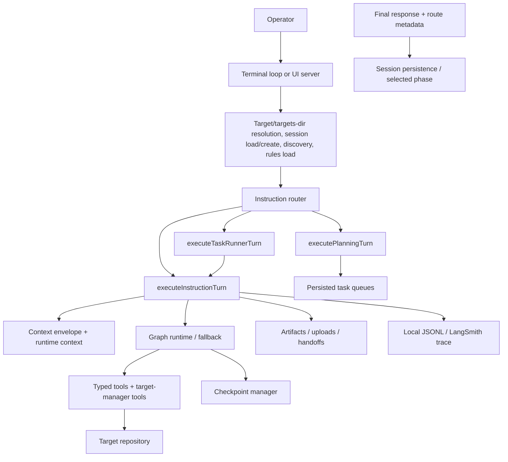
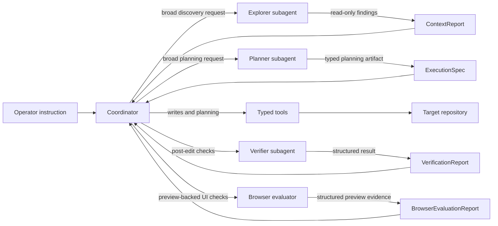

# Appendix: CODEAGENT.md

Submission template - fill in each section as you build. Do not write this at the end.

| Section | Due |
| --- | --- |
| Agent Architecture | MVP |
| File Editing Strategy | MVP |
| Multi-Agent Design | MVP |
| Trace Links | MVP |
| Architecture Decisions | Final Submission |
| Ship Rebuild Log | Final Submission |
| Comparative Analysis | Final Submission |
| Cost Analysis | Final Submission |

## Agent Architecture (MVP)

Shipyard is a local-first coding agent with two entry surfaces, one shared
session model, one standard-turn executor, and two additional routed turn
paths for planning and queued task execution. `src/bin/shipyard.ts` resolves
either a concrete target or a targets directory, creates or resumes a session,
refreshes discovery, loads target `AGENTS.md` rules when a target exists, and
then routes the operator into terminal REPL mode or browser `--ui` mode. From
there, the loop/UI router sends `plan:` into `src/plans/turn.ts`, sends `next`
and `continue` into `src/plans/task-runner.ts`, and sends standard
instructions into `src/engine/turn.ts`, which rebuilds the `ContextEnvelope`,
selects the current phase (`code` or `target-manager`), and runs the graph
runtime with raw fallback parity.

### Loop design

- `runShipyardLoop` in `src/engine/loop.ts` keeps the process alive, exposes
  utility commands like `read`, `list`, `search`, `run`, `diff`, `target`,
  `plan:`, `next`, and `continue`, and routes the rest into the standard turn
  path.
- `executePlanningTurn` in `src/plans/turn.ts` runs the planner helper in a
  read-only path, captures any loaded `spec:` refs, and persists a typed task
  queue under `target/.shipyard/plans/`.
- `executeTaskRunnerTurn` in `src/plans/task-runner.ts` reloads the active plan,
  selects the right queued task, and then reuses `executeInstructionTurn` for
  the actual code-writing turn.
- `executeInstructionTurn` assembles stable runtime context, captures recent
  tool output and error summaries, wires reporter callbacks, emits or loads
  handoff artifacts, and persists updated session state after the turn
  completes.
- `runAgentRuntime` in `src/engine/graph.ts` executes the explicit
  `triage -> plan -> act -> verify -> recover -> respond` state machine. The
  front-door `triage` step is deterministic and classifies work as direct,
  targeted, or broad before planner or browser-evaluator delegation is even
  considered. When the runtime is started in fallback mode, the system
  preserves the same planning, tool, verification, and response contract, but
  executes it through the lower-level loop in `src/engine/raw-loop.ts`.

### Tool calls

The code phase currently exposes ten typed tools through the registry:
`read_file`, `load_spec`, `write_file`, `bootstrap_target`, `edit_block`,
`list_files`, `search_files`, `run_command`, `git_diff`, and `deploy_target`.
Target-manager mode exposes `list_targets`, `select_target`, `create_target`,
and `enrich_target`. Tool execution is structured, target-relative where
appropriate, and schema-described before it reaches the model.

### State management

- `SessionState` in `src/engine/state.ts` persists durable session data under
  `target/.shipyard/sessions/<sessionId>.json`.
- `InstructionRuntimeState` in `src/engine/turn.ts` keeps per-session rolling
  context such as `recentToolOutputs`, `recentErrors`, `retryCountsByFile`,
  `blockedFiles`, pending target selection, and the selected runtime mode.
- `AgentGraphState` in `src/engine/graph.ts` carries the active instruction,
  `messageHistory`, `taskPlan`, `executionSpec`, `planningMode`,
  `verificationReport`, `browserEvaluationReport`, `harnessRoute` (including
  task complexity), `lastEditedFile`, recovery counters, and `langSmithTrace`.
- `PersistedTaskQueue` plus `ActiveTaskContext` in `src/plans/` carry reviewable
  multi-task work without stretching `rollingSummary`.
- Checkpoints are stored under
  `target/.shipyard/checkpoints/<sessionId>/...checkpoint`, and local trace logs
  are stored under `target/.shipyard/traces/<sessionId>.jsonl`.
- Plan queues are stored under `target/.shipyard/plans/<planId>.json`, and UI
  uploads are stored under `target/.shipyard/uploads/<sessionId>/...`.
- Long-running or unstable turns can emit typed `ExecutionHandoff` artifacts
  under `target/.shipyard/artifacts/<sessionId>/...handoff.json`. Session state
  keeps only `activeHandoffPath`, and resumed turns inject the loaded handoff
  into `ContextEnvelope.session.latestHandoff` instead of stuffing that state
  into `rollingSummary`.

### Entry conditions

- Target directory or targets directory is resolved and `.shipyard/` runtime
  directories exist.
- Discovery has been refreshed for the selected repository or targets root.
- Project rules from target `AGENTS.md` have been loaded into the stable
  context layer when available.
- A saved session has been resumed or a new session has been created.
- Runtime mode has been chosen: graph by default, fallback when explicitly
  requested or injected.

### Normal exit conditions

- The graph reaches `respond` and marks the turn `done`.
- A fallback run returns final text without unhandled runtime errors.
- A planning turn saves a typed plan queue and loaded spec refs.
- Session state, plan/task metadata, rolling summaries, and trace references
  are saved.
- Terminal mode can later exit the process cleanly with `quit` or `exit`, which
  emits a `session.end` trace record and writes the final session snapshot.

### Error branches

- Tool failures are surfaced as structured tool results instead of crashing the
  loop.
- Verification failure sends the graph into `recover`, where the latest
  checkpoint is restored and the edited file is re-read before replanning.
- If a file keeps failing verification beyond the retry cap, the file is added
  to `blockedFiles` and the coordinator escalates instead of writing again.
- Hosted access, deploy, upload, and plan/task-runner errors stay structured at
  the turn boundary rather than leaking untyped exceptions into the operator
  shell.
- Runtime-level failures produce a final `failed` status and preserve the last
  error in state.

## File Editing Strategy (MVP)

Shipyard makes surgical edits by combining a prior `read_file` requirement, an
exact-string anchor, hash tracking, and checkpoint-backed recovery.

1. The runtime first calls `read_file` for the target path. This normalizes the
   path, returns file contents, and stores a tracked SHA-256 hash in
   `src/tools/file-state.ts`.
2. When the model is ready to edit, it calls `edit_block` with the same
   relative path plus `old_string` and `new_string`.
3. `edit_block` resolves the path inside the target, re-reads the live file,
   and rejects the edit immediately if the file was never read first.
4. The tool compares the current hash against the tracked read hash. If the file
   changed since the read, the edit is rejected as stale and the model must
   re-read before trying again.
5. The tool counts occurrences of `old_string`. The edit only proceeds when the
   anchor matches exactly once.
6. For larger files, `edit_block` rejects changes that would rewrite more than
   60% of a file larger than 500 characters. The exception is Shipyard-tagged
   starter scaffold files, which can be fully restyled without tripping the
   generic rewrite limit.
7. Under the graph runtime, a checkpoint is created before each `edit_block`
   call so failed verification can revert the file.
8. After a successful write, the tool returns the updated contents, the new
   hash, line-count deltas, and before/after previews so the coordinator can
   summarize exactly what changed.

### How the correct block is located

- The locator is the literal `old_string`, not a line number.
- Path matching is target-relative and normalized before access.
- Uniqueness is mandatory. Exact-one-match is the guardrail that makes the edit
  deterministic.

### What happens when the location is wrong

| Failure mode | Response |
| --- | --- |
| File was not read first | Reject with "Read the file with read_file before editing." |
| File changed after read | Reject as stale and require a fresh read. |
| Anchor not found | Reject and include the first 30 lines of the live file to help the coordinator re-anchor. |
| Anchor matched multiple times | Reject and ask for more surrounding context so the match becomes unique. |
| Edit is too large | Reject and require smaller `edit_block` calls unless the file is a tagged Shipyard starter scaffold that is meant to be replaced wholesale. |
| Post-edit verification fails | Restore the checkpoint, re-read the file, increment retry state, and either replan or block the file. |

This mechanism deliberately prefers false negatives over ambiguous writes. When
Shipyard cannot prove the anchor is correct, it stops and asks the model to get
more context.

## Multi-Agent Design (MVP)

The shipped runtime still uses a single writing coordinator. The graph runtime
routes broad discovery requests through the explorer helper, broad non-trivial
planning requests through the planner helper, post-edit command checks through
the verifier helper, and preview-backed UI checks through the browser
evaluator. `src/agents/coordinator.ts` owns the task plan, every write, the
delegation heuristics, and the final merge of evidence. `src/agents/explorer.ts`
defines the read-only discovery role, `src/agents/planner.ts` emits the typed
`ExecutionSpec` artifact, `src/agents/verifier.ts` executes ordered command
checks, and `src/agents/browser-evaluator.ts` inspects loopback previews
without crossing the coordinator-only write boundary.

### Orchestration model

- The coordinator remains the only writer. This is the core safety rule.
- Broad instructions without known target paths can trigger the explorer, while
  exact-path or greenfield instructions can skip that extra hop.
- Broad non-trivial code-phase instructions can also trigger the planner, while
  exact-path, target-manager, and clearly lightweight requests stay on the
  existing lightweight path.
- The explorer starts from fresh history, uses only `read_file`, `list_files`,
  and `search_files`, and returns a `ContextReport`.
- The planner starts from fresh history, uses only `read_file`, `load_spec`,
  `list_files`, and `search_files`, and returns an `ExecutionSpec`.
- The verifier starts from fresh history, uses only `run_command`, and returns
  a `VerificationReport`.
- The browser evaluator uses Playwright against loopback preview URLs only and
  returns a `BrowserEvaluationReport`.
- The coordinator decides when to spawn those helpers, how much of their output
  to keep, and whether to proceed, retry, recover, or escalate.

### How agents communicate

- Communication is report-based, not chat-history-based.
- Explorer output is shaped as `ContextFinding[]` inside a `ContextReport`.
- Planner output is shaped as a typed `ExecutionSpec`.
- Verifier output is shaped as a typed `VerificationReport`.
- Browser-evaluator output is shaped as a `BrowserEvaluationReport`.
- The coordinator summarizes those reports into its own planning state instead
  of copying raw logs or raw search hits wholesale.

### How parallel outputs are merged

The merge authority stays centralized:

- discovery evidence narrows file selection and plan steps
- planning evidence makes goals, deliverables, acceptance criteria, and risks
  explicit before edits
- verification evidence decides whether edits are accepted, recovered, or
  blocked
- browser-evaluator evidence can tighten a command-passing verification result
  when the request is UI-facing and the preview surface is available
- if exploration and verification disagree, verification wins because it is
  direct runtime evidence rather than a guess from code search

This design keeps subagents useful without letting them race each other for
write authority.

## Trace Links (MVP)

The LangSmith MVP landed in commit `e978152`, and the repository still carries
the two canonical public trace examples below:

- Successful graph-mode file creation trace:
  [LangSmith trace](https://smith.langchain.com/o/4610debb-3062-47a4-a18d-faee6ddaa4c3/projects/p/debcf987-99bc-4986-b3e1-5af61ee1ff78/r/019d21b3-0b13-7000-8000-04db046b4bd7?trace_id=019d21b3-0b13-7000-8000-04db046b4bd7&start_time=2026-03-24T21:14:35.155001)
- Fallback-mode missing-file error trace:
  [LangSmith trace](https://smith.langchain.com/o/4610debb-3062-47a4-a18d-faee6ddaa4c3/projects/p/debcf987-99bc-4986-b3e1-5af61ee1ff78/r/019d21b3-2e81-7000-8000-07611bad5091?trace_id=019d21b3-2e81-7000-8000-07611bad5091&start_time=2026-03-24T21:14:44.225001)

Every local run also writes JSONL traces to
`target/.shipyard/traces/<sessionId>.jsonl`, so the runtime always has a local
audit trail even when LangSmith credentials are absent. Long-run reset routing
adds handoff payloads to local `instruction.plan` events and records
`handoffLoaded`, `handoffPath`, and `handoffReason` in trace metadata.

## Architecture Decisions (Final Submission)

The current `HEAD` architecture is the result of a few decisions that survived
the entire rebuild:

| Decision | Why it stuck | History evidence |
| --- | --- | --- |
| Persistent local sessions instead of one-shot CLI runs | Sessions let Shipyard preserve discovery, rolling summaries, and recovery state across turns. | `93d239a`, `f28c451`, `15bbdef` |
| Typed tool registry instead of ad hoc filesystem/shell access inside the loop | Tool schemas, registration, and structured results keep the model-facing surface inspectable and testable. | `de94cc6`, `4a9de9c` |
| Anchor-based `edit_block` instead of line-number or full-file rewriting | A literal anchor plus hash checks works across TypeScript, JSON, Markdown, and config files without a language-specific AST stack. | `e3f3158`, `2e044c1` |
| Checkpoint-backed recovery instead of "best effort" retries | If verification fails, the system can restore the file before trying again rather than compounding damage. | `4f02495`, `98fc167` |
| Graph runtime with raw fallback instead of betting on one loop implementation | The graph model makes planning and recovery explicit, while fallback preserves a simpler operational escape hatch. | `98fc167`, `e978152` |
| One shared turn executor for terminal and browser mode | This avoids maintaining two agent semantics and forced later UI fixes to improve the shared core instead of forking logic. | `46887a3`, `2dca737`, `c5b7d11`, `15bbdef` |
| Single-writer coordinator with isolated read-only or verification helpers | Centralized merge authority kept the system understandable while phase-6 plans matured. | `5c672f5`, `2ef53ab`, `src/agents/*.ts` |
| Local tracing first, LangSmith second | The repo can run offline or without vendor credentials, but still exposes trace links when configured. | `5c672f5`, `e978152`, `da74e4c` |

## Ship Rebuild Log (Final Submission)

The grouped log below covers every `HEAD` commit that touched `shipyard/`:
40 direct commits plus 10 merge checkpoints. `git log --follow shipyard/CODEAGENT.md`
also shows one pre-mainline ancestor, `6b99fba`, where the first version of
this file appeared before the nested workspace layout settled.

| Wave | Commits | Outcome |
| --- | --- | --- |
| Prehistory | `6b99fba` | First `CODEAGENT.md` scaffold before the repo settled into the checked-in `shipyard/` layout. |
| Workspace bootstrap | `5c672f5` | Created the nested Shipyard app, initial docs, agents, tools, tracing, checkpoints, tests, and this appendix file. |
| Spec pack foundation | `89d17c5`, `31ab087`, `879504e`, `6e81346`, `cf2faf4`, `f0cb877`, `21ba632`, `2ef53ab`, `3031f55`, `e22c0c0` | Established the repo's story-pack rhythm: tools, model wiring, graph runtime, UI, stress validation, local preview, cancellation, and subagent planning were all documented before or alongside implementation. |
| Persistent operator loop | `93d239a` | Turned Shipyard from static scaffold into a session-aware REPL with saved state and operator utility commands. |
| Tooling and edit safety | `de94cc6`, `e3f3158`, `2e044c1`, `4a9de9c` | Added self-registering tools, safe relative IO, stricter `edit_block` guardrails, and fuller tool/test coverage. |
| Browser runtime wave | `46887a3`, `2dca737`, `46b0d3c`, `c5b7d11` | Added `--ui`, live activity streaming, diff-first workbench UX, and session rehydration without creating a second agent engine. |
| Model execution wave | `e9623e0`, `749443e`, `e6bab52` | Added Anthropic contract wiring, the raw tool loop, and live verification smoke coverage. |
| Graph, recovery, and tracing | `98fc167`, `4f02495`, `f28c451`, `e978152` | Added the graph runtime, checkpoint recovery, richer context injection, and LangSmith-backed MVP trace verification. |
| UI refresh and architecture docs | `296ee25`, `136d159`, `8c4301c` | Refreshed the visual system, added durable architecture docs, and expanded repo navigation and diagrams. |
| Hardening and polish | `dba7eb5`, `b6d78f3`, `ad260c2`, `15bbdef`, `a5f5cfe`, `867e3bf`, `fb4774e` | Forced live runtime behavior, improved activity/diff surfaces, stabilized reconnects, polished context/session flows, clarified workspace identity and port collisions, aligned UI error tests, and hardened CLI loop milestones. |
| Merge checkpoints | `bb64d47`, `c0d62af`, `11e214a`, `72a0799`, `ba6beb7`, `0353679`, `a413190`, `1fd948e`, `e728821`, `d43c9f7` | Merged the major waves back into `main`, showing a repeated pattern of short-lived `codex/` branches landing as reviewable increments. |

## Comparative Analysis (Final Submission)

| Concern | Chosen approach | Alternative | Why Shipyard's choice was better for this repo |
| --- | --- | --- | --- |
| Turn orchestration | Explicit graph runtime with raw fallback | Raw loop only or graph only | Graph nodes made recovery and status routing legible, but fallback preserved an easier operational escape hatch. |
| File mutation | Hash-gated anchor replacement with checkpoints | Line-number patches, regex patches, or full-file rewrites | The chosen design works across code and docs, fails closed on ambiguity, and gives recovery a clean revert point. |
| Tool surface | Typed registry with schema-described tools | Shell-first free-form commands embedded in prompts | Registry-based tools are easier to test, trace, and reason about than hidden side effects in the agent loop. |
| UI architecture | Local browser workbench over the same session engine | Separate backend service or separate browser-only agent runtime | Reusing the same `executeInstructionTurn` path prevented feature drift and kept fixes concentrated in one runtime. |
| Multi-agent model | Single writer plus isolated helper roles | Symmetric multi-writer agents | Centralized writes are slower to scale, but much safer while the repo is still stabilizing recovery, tracing, and verification. |
| Observability | Local JSONL default with optional LangSmith | LangSmith-only tracing | The local-first default keeps the app usable in any environment while still allowing linked traces for MVP validation. |

The commit history reinforces that each time Shipyard added capability, it
biased toward explicit contracts and reversible behavior over cleverness. That
pattern is visible in the tool registry, checkpoint recovery, trace layering,
and the still-conservative subagent plan.

## Cost Analysis (Final Submission)

This repo does not track dollar cost inside Git, so the best comparable measure
is engineering cost expressed through commit count, churn, and where the churn
landed.

| Metric | Value | Interpretation |
| --- | --- | --- |
| Mainline commits touching `shipyard/` | 50 total: 40 direct commits and 10 merge commits | The rebuild happened as many small landings instead of one rewrite dump. |
| Code churn | 29,111 insertions and 3,375 deletions | The app mostly expanded rather than refactored in place; the insertion/deletion ratio is about `8.63:1`. |
| Commit mix | 19 `feat`, 13 `docs`, 5 `fix`, 2 `chore`, 1 `test` | Nearly a third of the work went into specs and docs, which matches the repo's spec-driven operating model. |
| Biggest single churn spikes | `5c672f5`, `46b0d3c`, `46887a3`, `296ee25`, `c5b7d11` | The largest costs were bootstrap plus UI/workbench waves, not the later hardening passes. |
| Highest recurring cost center | Browser workbench and operator UX | UI mode introduced the most repeated follow-up work: initial runtime, activity stream, diff-first workbench, rehydration, visual refresh, reconnect hardening, and session/context polish. |
| Lowest-cost high-leverage additions | `e978152`, `da74e4c`, `136d159` | Trace linking, finish-gate workflow, and architecture docs improved debuggability and handoff quality without the churn of the UI waves. |

### Cost takeaways

- The expensive part of Shipyard was not tool registration or tracing. It was
  building and then refining the second operator surface without splitting the
  runtime in two.
- Documentation is a first-class cost in this repo by design. The story packs
  and architecture docs are not overhead around the system; they are part of how
  the system is built and reviewed.
- Phase 6 subagents currently cost more in design than in code. The commit
  history shows the team intentionally paying documentation and planning cost
  first so the eventual implementation can preserve the single-writer safety
  model.
