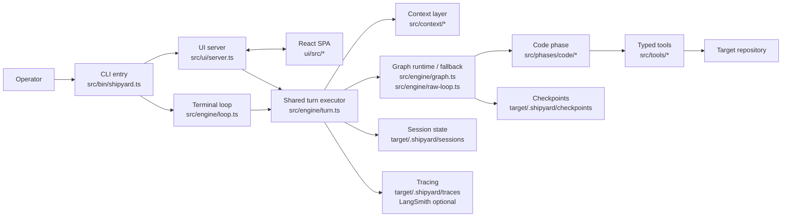
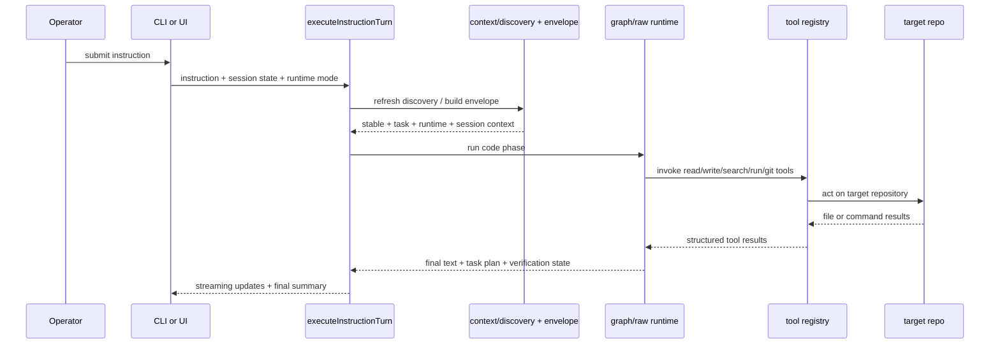
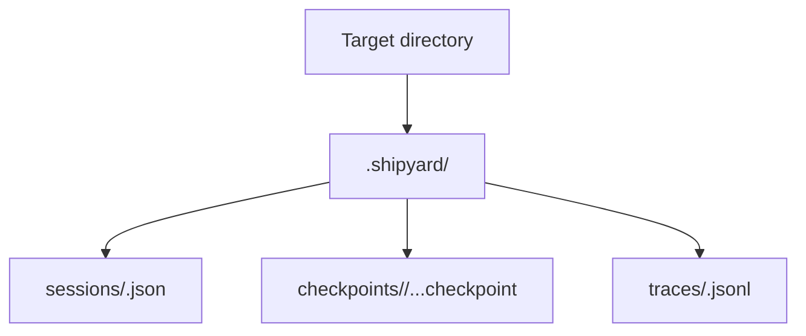

# Shipyard Architecture

Shipyard is a local-first coding-agent runtime with two operator surfaces that
share one execution core:

- terminal REPL mode
- browser workbench mode via `--ui`

Both surfaces converge on the same session model, context envelope, tool
registry, and graph-or-fallback instruction executor.

## System Map

## Instruction Flow

## Runtime Artifact Layout

## Layer Responsibilities

- `src/bin/` parses process arguments, initializes discovery/session state, and
  chooses terminal or browser mode.
- `src/context/` inspects the target repository and serializes a reusable
  prompt context envelope, including target `AGENTS.md` rules when present.
- `src/engine/` owns the persistent loop, shared turn execution path, graph
  runtime, fallback raw loop, and session persistence.
- `src/agents/` holds the coordinator-only write boundary plus isolated
  helper runtimes such as the read-only explorer and verifier roles.
- `src/tools/` exposes the bounded file/search/command primitives available to
  the code phase.
- `src/checkpoints/` snapshots files before `edit_block` writes so recovery can
  revert failed attempts.
- `src/tracing/` writes local JSONL traces and attaches LangSmith when the
  required environment variables are configured.
- `src/ui/` is the backend half of browser mode. The React frontend lives under
  `ui/` and speaks to this layer over a typed WebSocket contract.

## Design Rules

- Keep instruction logic in `src/engine/turn.ts` so terminal mode and UI mode
  stay behaviorally aligned.
- Add new filesystem or process capabilities as typed tools under `src/tools/`,
  then expose them through the phase configuration rather than reaching around
  the tool registry.
- Treat `target/.shipyard/` as runtime output, not as hand-authored source.
- When documenting new features, prefer adding durable notes here and linking
  to any relevant story pack under `docs/specs/`.
