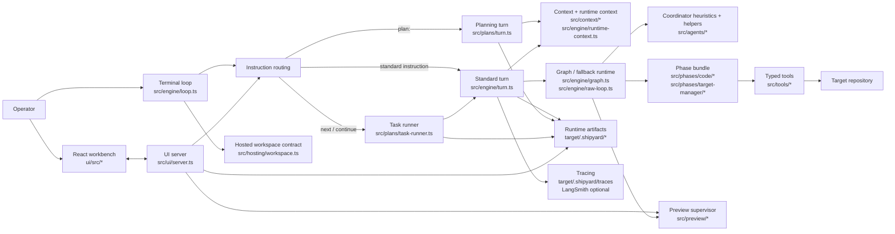
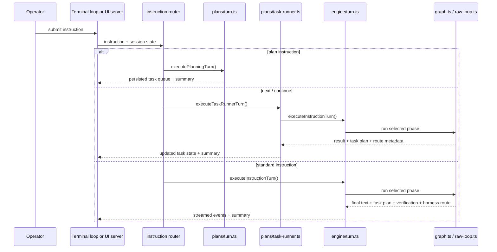
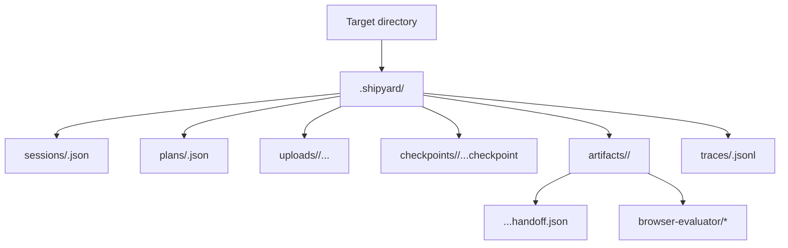

# Shipyard Architecture

Shipyard is a local-first coding-agent runtime with two operator surfaces and
one shared session model:

- terminal REPL mode
- browser workbench mode via `--ui`

Those surfaces share the same turn routing, session persistence, context
envelope, tool registry, cancellation behavior, tracing pipeline, and
target-local runtime artifacts. The main distinction is transport: readline in
the terminal and HTTP/WebSocket in the browser runtime.

Shipyard also supports three instruction paths over that shared runtime:

- target-manager turns when no concrete target has been selected yet
- planning turns for `plan:`, followed by `next` / `continue`
- standard code turns through the graph runtime with raw fallback parity

The hosted Railway baseline for the browser runtime is documented in
[`hosted-railway.md`](./hosted-railway.md).

## System Map

## Turn Routing

## Graph Runtime

The graph runtime in `src/engine/graph.ts` is the current source of truth for
how Shipyard routes standard code turns.

```mermaid
flowchart TD
  TriageNode["triage<br/>direct vs targeted vs broad"]
  PlanNode["plan"]
  NeedExplorer{"Explorer needed?"}
  Explorer["Explorer subagent<br/>read_file / list_files / search_files"]
  NeedPlanner{"Planner needed?"}
  Planner["Planner subagent<br/>read_file / load_spec / list_files / search_files"]
  PlanArtifacts["TaskPlan + optional ExecutionSpec<br/>harnessRoute selected"]
  ActNode["act<br/>raw tool loop<br/>checkpoint before edit_block"]
  VerifyNode["verify<br/>verifier checks"]
  NeedBrowser{"Browser evaluator needed?"}
  BrowserEval["Browser evaluator<br/>loopback preview only"]
  Passed{"Verification passed?"}
  RecoverNode["recover<br/>restore checkpoint<br/>re-read file<br/>update retry counts"]
  RetryCap{"Retry cap hit?"}
  RespondNode["respond"]
  TurnWrapper["turn.ts wrapper<br/>handoff decision + session save"]

  TriageNode --> PlanNode
  PlanNode --> NeedExplorer
  NeedExplorer -- yes --> Explorer
  NeedExplorer -- no --> NeedPlanner
  Explorer --> NeedPlanner
  NeedPlanner -- yes --> Planner
  NeedPlanner -- no --> PlanArtifacts
  Planner --> PlanArtifacts
  PlanArtifacts --> ActNode
  ActNode --> VerifyNode
  VerifyNode --> NeedBrowser
  NeedBrowser -- yes --> BrowserEval
  NeedBrowser -- no --> Passed
  BrowserEval --> Passed
  Passed -- yes --> RespondNode
  Passed -- no --> RecoverNode
  RecoverNode --> RetryCap
  RetryCap -- no --> PlanNode
  RetryCap -- yes --> RespondNode
  RespondNode --> TurnWrapper
```

### What Each Node Does

- `plan`: optionally gathers read-only context with the explorer, optionally
  upgrades broad instructions to a planner-backed `ExecutionSpec`, and always
  emits a coordinator `TaskPlan`.
- `triage`: classifies the request up front so exact-path or clearly targeted
  work can stay lightweight while broad, cross-cutting work keeps the heavier
  planner/browser-evaluator lane.
- `act`: runs the raw model/tool loop for the current phase. `edit_block`
  writes are checkpointed first.
- `verify`: runs the verifier's command-based `EvaluationPlan`. If the request
  looks UI-relevant, the request was classified as broad (or explicitly asked
  for preview verification), and a loopback preview is running, Shipyard also
  runs the browser evaluator and folds its result into the final verification
  report.
- `recover`: restores the latest checkpoint, re-reads the edited file, and
  either replans or blocks the file after repeated failures.
- `respond`: finalizes the turn outcome. `engine/turn.ts` then decides whether
  to persist an `ExecutionHandoff`.

## Runtime Artifact Layout

## Layer Responsibilities

- `src/bin/`: parses process arguments, prepares hosted workspace constraints
  when needed, initializes discovery/session state, and chooses terminal or
  browser mode.
- `src/context/`: inspects the target repository and serializes the stable
  prompt context envelope, including target `AGENTS.md` rules when present.
- `src/engine/`: owns the shared turn executor, graph runtime, fallback raw
  loop, cancellation, history compaction, runtime-context injection, handoff
  emission/loading, and session persistence.
- `src/engine/model-routing.ts`: owns provider/model selection. The current
  shipped default route is OpenAI (`gpt-5.4`), while Anthropic remains
  available through routing overrides.
- `src/engine/model-adapter.ts`: owns the internal provider-neutral turn and
  tool contract. Provider modules such as `src/engine/anthropic.ts` should
  project generic tool definitions into provider wire formats instead of
  leaking SDK types into the shared runtime boundary.
- `src/plans/`: owns `plan:` creation, persisted task queues, spec-ref capture,
  and `next` / `continue` task execution over the shared turn runtime.
- `src/agents/`: keeps the coordinator-only write boundary plus isolated
  explorer, planner, verifier, and browser-evaluator helper runtimes.
- `src/phases/`: defines the tool/prompt bundles for `code` and
  `target-manager`.
- `src/tools/`: exposes bounded file, spec, search, command, bootstrap, deploy,
  and target-manager capabilities through the registry.
- `src/checkpoints/`: snapshots files before `edit_block` writes so recovery
  can revert failed attempts.
- `src/tracing/`: writes local JSONL traces, records handoff and harness-route
  metadata, and attaches LangSmith metadata when configured.
- `src/ui/`: is the backend half of browser mode. It manages WebSocket
  streaming, hosted access, uploads, target-manager state, preview-state
  publishing, and deploy summaries.
- `src/preview/`: owns loopback-only preview detection and the session-scoped
  preview supervisor used for local preview state and browser evaluation.
- `src/hosting/`: validates the hosted workspace contract for Railway-style
  deployments.

## Design Rules

- Keep standard instruction behavior in `src/engine/turn.ts` so terminal mode
  and UI mode stay aligned.
- Keep planning/task-queue behavior in `src/plans/` and reuse the shared turn
  runtime instead of inventing a second execution engine.
- Add new filesystem or process capabilities as typed tools under `src/tools/`,
  then expose them through a phase bundle rather than reaching around the
  registry.
- Keep provider-specific SDK wire types and tool-shape projection inside
  adapter modules such as `src/engine/anthropic.ts`. The shared registry should
  expose only generic `ToolDefinition` metadata and execution behavior.
- Treat `target/.shipyard/` as runtime output, not as hand-authored source.
- Keep `rollingSummary` compact. Durable resume state belongs in typed plans or
  handoff artifacts, with only lightweight pointers persisted in session state.
- Keep browser evaluation loopback-only; production deployment URLs belong to
  `deploy_target`, not the preview supervisor.
- When documenting new features, prefer durable notes here and link out to the
  relevant story pack under `docs/specs/`.
