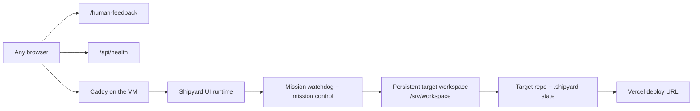

# Remote Linux Mission Hosting

This pack is the easiest path to keep Shipyard building without depending on a
laptop. It keeps the authoritative workbench, target directory, `.shipyard/`
runtime state, backups, and long-run `ultimate` recovery on one always-on Linux
host.

Public and private surfaces stay intentionally separate:

- the Shipyard workbench lives on your server
- `/human-feedback` gives you a lightweight remote control page
- `/api/health` is the remote health probe
- the target app stays public through Vercel
- loopback preview remains internal to Shipyard

## Why This Path

Use this pack when you want all of the following at once:

- a long-running `ultimate` loop that survives process restarts
- target-local backups, handoffs, and mission state on persistent disk
- remote browser access to the workbench from anywhere
- a public target-app URL that keeps updating on a schedule
- no dependence on a local macOS LaunchAgent

This pack wraps the existing runtime instead of inventing a second deployment
model:

- `scripts/ultimate-mission-watchdog.ts`
- `scripts/ultimate-mission-control.ts`
- `src/mission-control/*`
- `docs/architecture/mission-control.md`
- `docs/architecture/hosted-railway.md`

## Recommended Topology



## Recommended Host

- Ubuntu 24.04 LTS
- 2 vCPU / 8 GB RAM minimum for one active long-run mission
- one persistent disk mounted for `/srv/workspace`
- one DNS name for the Shipyard workbench, for example
  `shipyard.example.com`
- one Vercel project for the public target app

## Checked-In Templates

- [`templates/linux-mission/bootstrap-ubuntu-shipyard.sh`](./templates/linux-mission/bootstrap-ubuntu-shipyard.sh)
- [`templates/linux-mission/shipyard.env.example`](./templates/linux-mission/shipyard.env.example)
- [`templates/linux-mission/mission.config.json`](./templates/linux-mission/mission.config.json)
- [`templates/linux-mission/shipyard-mission.service`](./templates/linux-mission/shipyard-mission.service)
- [`templates/linux-mission/shipyard-vercel-sync.service`](./templates/linux-mission/shipyard-vercel-sync.service)
- [`templates/linux-mission/shipyard-vercel-sync.timer`](./templates/linux-mission/shipyard-vercel-sync.timer)
- [`templates/linux-mission/vercel-sync.sh`](./templates/linux-mission/vercel-sync.sh)
- [`templates/linux-mission/Caddyfile`](./templates/linux-mission/Caddyfile)

## Server Layout

This guide assumes the following paths:

- repo checkout: `/srv/shipyard`
- app working directory: `/srv/shipyard/shipyard`
- targets root: `/srv/workspace`
- target directory: `/srv/workspace/ship-promptpack-ultimate`
- mission bundle:
  `/srv/workspace/ship-promptpack-ultimate/.shipyard/ops/<session-id>/`
- service env file: `/etc/shipyard/shipyard.env`

## Setup

### 1. Provision the VM

- create the Ubuntu host
- point DNS for `shipyard.example.com` at the VM
- attach and mount the persistent workspace disk
- open ports `80` and `443`

### 2. Bootstrap the host

Copy the checked-in bootstrap script to the server, then run it as root:

```bash
scp shipyard/docs/ops/templates/linux-mission/bootstrap-ubuntu-shipyard.sh root@shipyard.example.com:/root/
ssh root@shipyard.example.com 'bash /root/bootstrap-ubuntu-shipyard.sh'
```

The bootstrap script installs Node, pnpm, git, Caddy, clones or updates the
repo into `/srv/shipyard`, and builds Shipyard once so the host is ready for
service startup.

### 3. Copy the target and its runtime state to the server

For continuity, copy the full target directory including `.shipyard/`:

```bash
rsync -az --delete /path/to/ship-promptpack-ultimate/ admin@shipyard.example.com:/srv/workspace/ship-promptpack-ultimate/
ssh admin@shipyard.example.com 'sudo chown -R shipyard:shipyard /srv/workspace/ship-promptpack-ultimate'
```

If you start from scratch on the server instead, the first remote workbench run
will create a new session and mission bundle there. For an existing long-run
mission, copying `.shipyard/` is what preserves handoffs, traces, backups, and
the current saved session.

### 4. Create the service env file

Start from the checked-in example:

```bash
ssh admin@shipyard.example.com 'sudo cp /srv/shipyard/shipyard/docs/ops/templates/linux-mission/shipyard.env.example /etc/shipyard/shipyard.env && sudo chmod 600 /etc/shipyard/shipyard.env'
```

Then edit `/etc/shipyard/shipyard.env` and set at least:

- `SHIPYARD_ACCESS_TOKEN`
- `SHIPYARD_HOSTED_URL`
- `ANTHROPIC_API_KEY`
- `VERCEL_TOKEN`
- `MISSION_CONFIG_PATH`
- `TARGET_DIR`

If you want GitHub binding and PR/merge support from the hosted workbench, also
set `GITHUB_TOKEN`.

### 5. Create the mission bundle

On the server:

```bash
sudo -u shipyard mkdir -p /srv/workspace/ship-promptpack-ultimate/.shipyard/ops/<session-id>/
sudo -u shipyard cp /srv/shipyard/shipyard/docs/ops/templates/linux-mission/mission.config.json /srv/workspace/ship-promptpack-ultimate/.shipyard/ops/<session-id>/mission.config.json
```

Then edit `mission.config.json` and replace:

- `__MISSION_ID__`
- `__SESSION_ID__`
- `__ACCESS_TOKEN__`
- `__HOSTED_URL__`

The mission config should point at:

- `shipyardDirectory=/srv/shipyard/shipyard`
- `targetDirectory=/srv/workspace/ship-promptpack-ultimate`
- the exact saved `sessionId` you want to keep running

Create or update the companion files in the same mission directory:

- `brief.md`
- `sticky-feedback.json`

`brief.md` is the durable `ultimate start` brief that mission control replays
after restarts. `sticky-feedback.json` is a JSON array of follow-up guidance to
requeue after recovery.

### 6. Install the reverse proxy

Copy the checked-in Caddyfile template into place:

```bash
ssh admin@shipyard.example.com 'sudo cp /srv/shipyard/shipyard/docs/ops/templates/linux-mission/Caddyfile /etc/caddy/Caddyfile'
```

Edit `/etc/caddy/Caddyfile` and replace `shipyard.example.com` with your real
domain if needed.

### 7. Install the systemd units

Copy the units into `/etc/systemd/system/`:

```bash
ssh admin@shipyard.example.com 'sudo cp /srv/shipyard/shipyard/docs/ops/templates/linux-mission/shipyard-mission.service /etc/systemd/system/'
ssh admin@shipyard.example.com 'sudo cp /srv/shipyard/shipyard/docs/ops/templates/linux-mission/shipyard-vercel-sync.service /etc/systemd/system/'
ssh admin@shipyard.example.com 'sudo cp /srv/shipyard/shipyard/docs/ops/templates/linux-mission/shipyard-vercel-sync.timer /etc/systemd/system/'
ssh admin@shipyard.example.com 'sudo systemctl daemon-reload'
```

### 8. Start everything

```bash
ssh admin@shipyard.example.com 'sudo systemctl enable --now caddy shipyard-mission.service shipyard-vercel-sync.timer'
```

## What You Can Check From Anywhere

- workbench: `https://shipyard.example.com`
- lightweight feedback page: `https://shipyard.example.com/human-feedback`
- health probe: `https://shipyard.example.com/api/health`
- public target app: your Vercel production URL

The pack intentionally does not depend on a separate live-console sidecar.
Today the stable remote control surfaces in `main` are the workbench,
`/human-feedback`, and `/api/health`.

## Verify the Host

Run these on the server after startup:

```bash
sudo systemctl status shipyard-mission.service
sudo systemctl status shipyard-vercel-sync.timer
curl -I https://shipyard.example.com/api/health
sudo journalctl -u shipyard-mission.service -f
sudo journalctl -u shipyard-vercel-sync.service -n 50
```

If the access token gate is enabled, an unauthenticated `/api/health` request
will return `401`. That is still enough to prove the proxy and runtime are
reachable before you authenticate in the browser.

Key target-local files to watch:

- `target/.shipyard/ops/<session-id>/mission-state.json`
- `target/.shipyard/ops/<session-id>/logs/mission-control.log`
- `target/.shipyard/ops/<session-id>/logs/mission-watchdog.log`
- `target/.shipyard/ops/<session-id>/backups/`

## What Is Public Versus Private

- Shipyard workbench: public web app behind your domain and access token
- `/human-feedback`: public remote control page behind the same access gate
- `/api/health`: public health endpoint behind the same access gate when the
  token is required
- preview URL: private, loopback-only runtime surface
- Vercel deploy URL: public target-app surface

Do not publish the preview port directly. If you need something shareable,
share the Vercel production URL.

## How The Two-Hour Deploy Sync Works

`shipyard-vercel-sync.timer` runs `vercel-sync.sh` every two hours and on boot.
The script:

1. builds the target with `TARGET_BUILD_COMMAND`
2. optionally retries with `TARGET_BUILD_FALLBACK_COMMAND`
3. deploys the built output directory to Vercel
4. writes deployment logs under `VERCEL_SYNC_STATE_DIR`

This timer is a backup publishing path. The primary long-run state still lives
in the target directory and mission bundle on the server.

## Recovery Notes

- If the workbench process dies, `shipyard-mission.service` keeps the watchdog
  alive and the watchdog respawns mission control.
- If the UI runtime stalls, mission control restarts it and replays the saved
  `ultimate` brief plus sticky feedback.
- If the session JSON or handoff artifact becomes invalid, mission control
  restores from the latest target-local backup before relaunching.
- If you want to rotate to a new session, update `MISSION_CONFIG_PATH`,
  `mission.config.json`, and the companion `brief.md`, then restart
  `shipyard-mission.service`.

## Optional Hardening

- add Playwright Linux browser dependencies if you want browser verification to
  stay fully available on the VM
- put the VM behind Cloudflare or another edge layer if you want another access
  control layer in front of Caddy
- add a second disk snapshot policy for `/srv/workspace`
- pin the repo checkout to a specific branch or tag if you want slower, more
  controlled runtime upgrades
