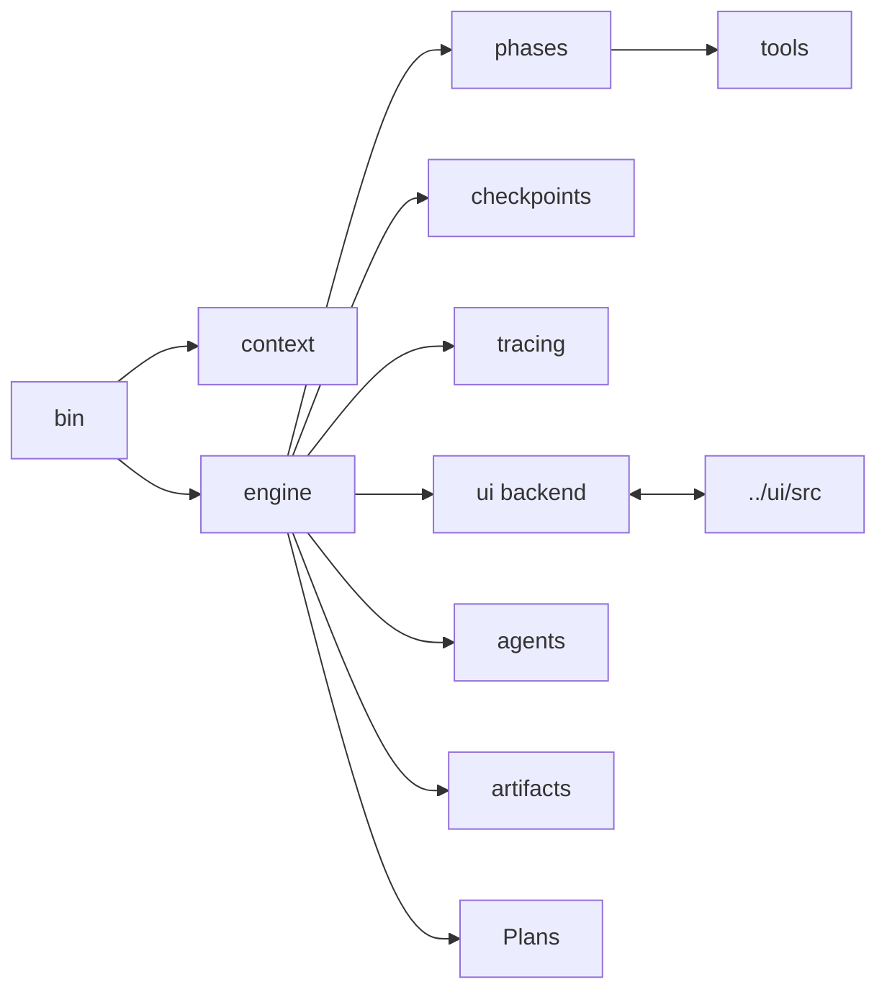

# Source Tree Guide

`src/` contains the runtime used by both Shipyard operator modes. The folders
below reflect stable subsystem boundaries rather than arbitrary file grouping.

## Directory Map

| Directory | Purpose | Notes |
| --- | --- | --- |
| [`agents/`](./agents/README.md) | role contracts for coordinator, explorer, and verifier | coordinator is the only writer |
| [`artifacts/`](./artifacts/README.md) | shared typed artifacts such as plans, verification reports, and discovery data | low-level schemas only |
| [`bin/`](./bin/README.md) | CLI entrypoint and process startup | parses `--target`, `--session`, and `--ui` |
| [`checkpoints/`](./checkpoints/README.md) | pre-edit snapshots and revert helpers | used by graph recovery |
| [`context/`](./context/README.md) | target discovery and context-envelope assembly | includes target `AGENTS.md` loading |
| [`engine/`](./engine/README.md) | shared turn execution, session state, graph runtime, and fallback loop | main behavior boundary |
| [`phases/`](./phases/README.md) | tool bundles, prompts, and phase config | currently centered on the code phase |
| [`plans/`](./plans/README.md) | planning-only executor, persisted task queues, and task-runner helpers | powers `plan:`, `next`, and `continue` |
| [`tools/`](./tools/README.md) | typed read/write/search/run/git primitives | the model-facing capability layer |
| [`tracing/`](./tracing/README.md) | local JSONL tracing and LangSmith integration | optional remote trace export |
| [`ui/`](./ui/README.md) | browser runtime backend and WebSocket contract | separate from the React SPA in `../ui/` |

## Source Diagram

## Choosing The Right Home

- Add startup flags or process boot logic in `bin/`.
- Add target analysis or prompt scaffolding in `context/`.
- Add shared runtime behavior in `engine/`.
- Add model-exposed capabilities in `tools/`.
- Add UI backend transport or state translation in `ui/`.
- Add new phase prompts or tool bundles in `phases/`.

## Cross-Cutting Rules

- Keep terminal mode and browser mode aligned by routing behavior through
  `engine/turn.ts`, `plans/turn.ts`, and `plans/task-runner.ts`.
- Prefer adding a new tool over embedding ad hoc filesystem or shell logic
  directly into runtime files.
- If a change adds a new durable concept, update the nearest local README and
  the architecture docs when the system shape changes.
