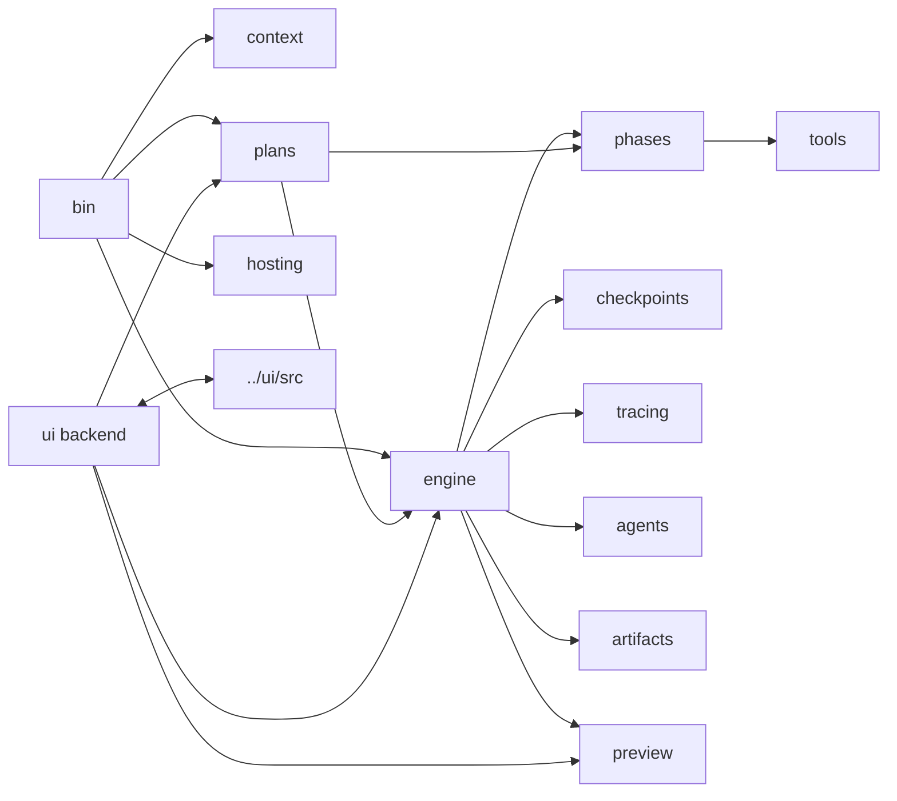

# Source Tree Guide

`src/` contains the runtime used by both Shipyard operator surfaces. The
folders below reflect stable subsystem boundaries rather than arbitrary file
grouping.

## Directory Map

| Directory | Purpose | Notes |
| --- | --- | --- |
| [`agents/`](./agents/README.md) | coordinator heuristics plus isolated explorer, planner, verifier, and browser-evaluator helpers | coordinator is the only writer |
| [`artifacts/`](./artifacts/README.md) | shared typed artifacts such as plans, verification reports, route summaries, and handoffs | low-level schemas only |
| [`bin/`](./bin/README.md) | CLI entrypoint and process startup | parses `--target`, `--targets-dir`, `--session`, and `--ui` |
| [`checkpoints/`](./checkpoints/README.md) | pre-edit snapshots and revert helpers | used by graph recovery |
| [`context/`](./context/README.md) | target discovery and context-envelope assembly | includes target `AGENTS.md` loading |
| [`engine/`](./engine/README.md) | shared standard-turn execution, graph runtime, raw fallback, and session state | main behavior boundary |
| [`hosting/`](./hosting/) | hosted workspace contract helpers | validates Railway-style persistent workspace assumptions |
| [`phases/`](./phases/README.md) | tool bundles and prompts for `code` and `target-manager` work | phases define model-visible capability envelopes |
| [`plans/`](./plans/README.md) | planning-only executor, persisted task queues, and task-runner helpers | powers `plan:`, `next`, and `continue` |
| [`preview/`](./preview/) | preview capability contracts and process supervisor | loopback-only preview lifecycle |
| [`tools/`](./tools/README.md) | typed read/write/search/run/bootstrap/deploy/target-manager primitives | the model-facing capability layer |
| [`tracing/`](./tracing/README.md) | local JSONL tracing and LangSmith integration | optional remote trace export |
| [`ui/`](./ui/README.md) | browser-runtime backend and WebSocket/HTTP contract | separate from the React SPA in `../ui/` |

## Source Diagram

## Choosing The Right Home

- Add startup flags, target resolution, or mode-selection logic in `bin/`.
- Add target analysis or prompt scaffolding in `context/`.
- Add standard-turn behavior in `engine/`.
- Add plan queueing or task-runner behavior in `plans/`.
- Add model-exposed capabilities in `tools/`.
- Add preview supervision or preview contracts in `preview/`.
- Add hosted workspace validation in `hosting/`.
- Add UI backend transport or state translation in `ui/`.

## Cross-Cutting Rules

- Keep terminal mode and browser mode aligned by routing shared behavior through
  `engine/turn.ts`, `plans/turn.ts`, and `plans/task-runner.ts`.
- Prefer adding a new tool over embedding ad hoc filesystem or shell logic
  directly into runtime files.
- Keep the coordinator as the only writer; helper agents stay report-based and
  isolated.
- If a change adds a new durable concept, update the nearest local README and
  the architecture docs when the system shape changes.
