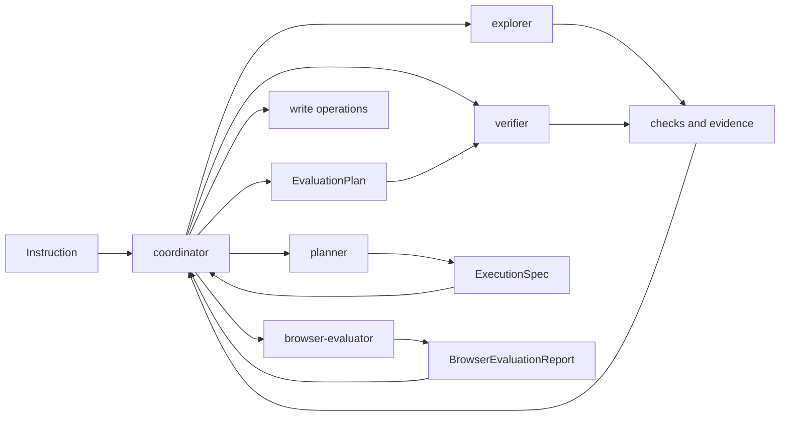

# Agents

This folder defines the role contracts that Shipyard reasons about when it
plans work. As Phase 6 lands, selected files also hold isolated helper
runtimes behind those roles.

## Files

- `coordinator.ts`: the only write-capable role; owns the task plan and the
  final execution path plus delegation heuristics for explorer, planner, and
  verifier
- `explorer.ts`: read-only search role plus the isolated explorer helper that
  returns `ContextReport`
- `planner.ts`: read-only planning role that turns broad instructions into
  typed `ExecutionSpec` artifacts
- `verifier.ts`: read-only validation role for ordered `EvaluationPlan`
  checks, tests, lint, and structured verification reports; now also exposes
  the isolated verifier helper runtime
- `browser-evaluator.ts`: read-only browser helper that inspects loopback
  previews and returns structured UI evidence without crossing the
  coordinator-only write boundary

## Important Constraint

Coordinator-only writes are a deliberate safety boundary. When the runtime
grows into true multi-agent execution, this directory should keep that boundary
explicit instead of allowing silent writes from helper roles.

## Diagram

