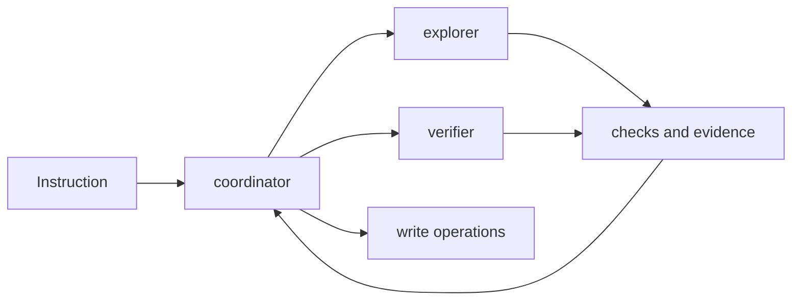

# Agents

This folder defines the role contracts that Shipyard reasons about when it
plans work. As Phase 6 lands, selected files also start to hold isolated helper
runtimes behind those roles.

## Files

- `coordinator.ts`: the only write-capable role; owns the task plan and the
  final execution path
- `explorer.ts`: read-only search and evidence gathering role
- `verifier.ts`: read-only validation role for tests, lint, and structured
  verification reports; now also exposes the isolated verifier helper runtime

## Important Constraint

Coordinator-only writes are a deliberate safety boundary. When the runtime
grows into true multi-agent execution, this directory should keep that boundary
explicit instead of allowing silent writes from helper roles.

## Diagram

