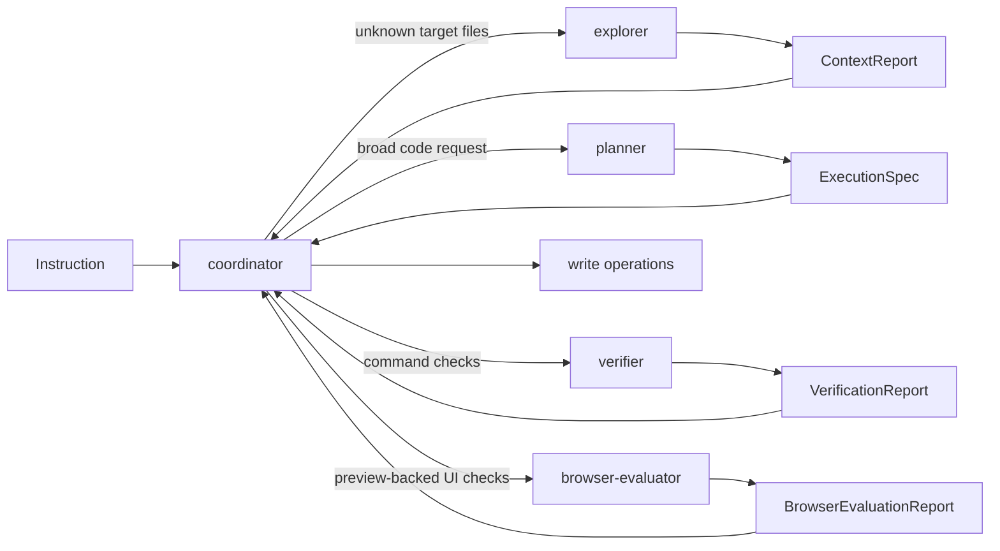

# Agents

This folder holds the coordinator heuristics and isolated helper runtimes that
the graph runtime can call during standard code turns.

## Files

- `coordinator.ts`: the only write-capable role; owns task-plan synthesis,
  lightweight-vs-planner-backed routing, verifier/browser-evaluator
  calibration, and file-path heuristics
- `explorer.ts`: read-only search role plus the isolated explorer helper that
  returns `ContextReport`
- `planner.ts`: read-only planning role that turns broad instructions into
  typed `ExecutionSpec` artifacts and can load named specs
- `verifier.ts`: read-only validation role for ordered `EvaluationPlan`
  checks, tests, lint, and structured verification reports
- `browser-evaluator.ts`: read-only Playwright helper that inspects loopback
  previews and returns structured browser evidence without crossing the
  coordinator-only write boundary

## Important Constraint

Coordinator-only writes are a deliberate safety boundary. Helper agents can
search, plan, verify, or inspect previews, but they do not mutate the target
repository directly.

## Diagram

## Helper-Agent Rules

- Helper agents start from fresh history instead of inheriting the
  coordinator's full conversation.
- Each helper has a tight tool allowlist and validates its own structured
  output before the coordinator consumes it.
- Explorer/planner work stays read-only and report-based.
- Browser evaluation must stay on loopback preview URLs; production deploy URLs
  are out of scope for this helper.
