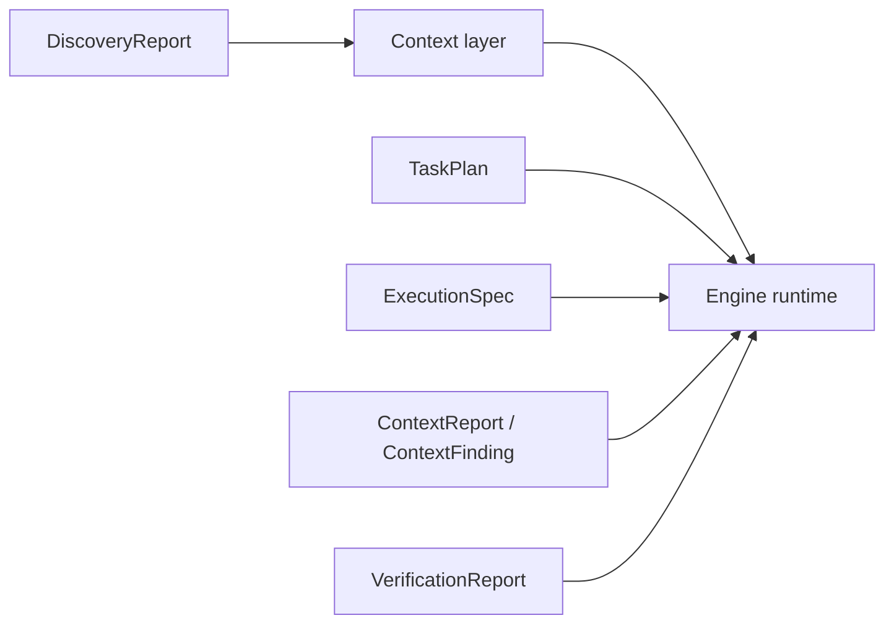

# Artifacts

This folder holds small shared types that move between runtime layers.

## Current Artifacts

- `TaskPlan`: the phase-level plan Shipyard produces before or during execution
- `ExecutionSpec`: the richer planner artifact for broad or non-trivial work
- `EvaluationPlan`: the richer verifier artifact for ordered command-backed
  checks with required/optional policy
- `ContextReport` and `ContextFinding`: structured evidence returned from
  exploratory work
- `EditIntent`: a typed description of a surgical file change
- `VerificationReport`: the shape used to report validation outcomes,
  including ordered per-check results when available
- `DiscoveryReport`: the normalized summary of the target repository

Keep this directory narrow. It should describe runtime contracts, not absorb
business logic.

## Diagram

