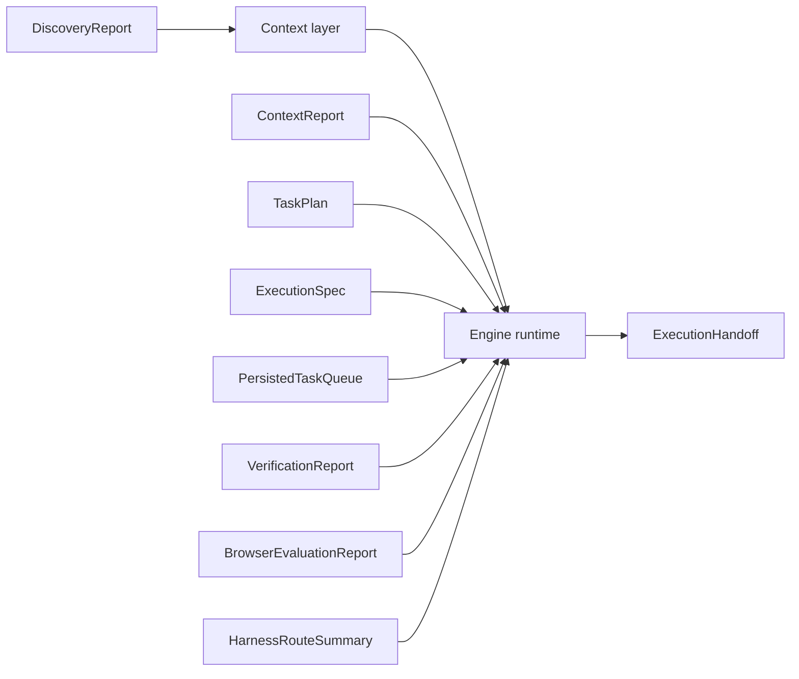

# Artifacts

This folder holds small shared types that move between runtime layers.

## Current Artifacts

- `TaskPlan`: the coordinator-facing lightweight plan Shipyard produces before
  or during execution
- `ExecutionSpec`: the richer planner artifact for broad or non-trivial code
  work
- `PersistedTaskQueue`, `PlanTask`, and `ActiveTaskContext`: the operator-facing
  planning/task-runner contracts saved under `.shipyard/plans/`
- `ContextReport` and `ContextFinding`: structured evidence returned from the
  explorer
- `EvaluationPlan`: the verifier's ordered command-check contract
- `VerificationReport` and `VerificationCheckResult`: structured validation
  outcomes, including per-check details plus command-readiness evidence when a
  long-lived preview server reached a usable ready state
- `BrowserEvaluationPlan` and `BrowserEvaluationReport`: loopback preview
  inspection contracts for UI-backed verification, including explicit
  infrastructure-degradation outcomes when browser dependencies are unavailable
- `HarnessRouteSummary`: selected lightweight vs planner-backed path,
  `actingMode` (`raw-loop` vs `direct-edit`), verification mode
  (`deterministic`, `deterministic+command`, or verifier-backed variants),
  browser-evaluator usage, browser failure kind, command readiness status, and
  handoff facts for a turn
- `DiscoveryReport`, `TargetProfile`, and preview/deploy-related view-model
  inputs
- `ExecutionHandoff` and `LoadedExecutionHandoff`: the durable long-run resume
  contract persisted under `.shipyard/artifacts/<sessionId>/...handoff.json`

Keep this directory narrow. It should describe runtime contracts, not absorb
business logic.

## Diagram

Handoff persistence should stay target-local, typed, and safe to reload after a
later turn. Keep write logic narrow and atomic enough for resume behavior.
