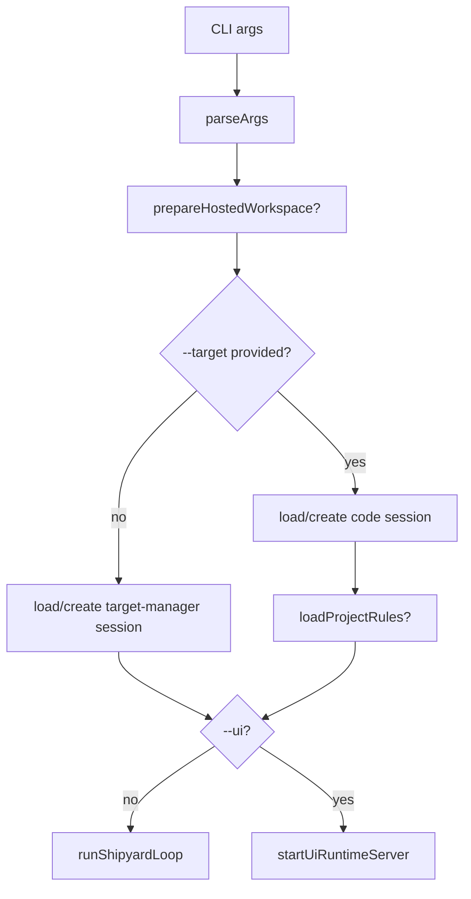

# CLI Entry

`src/bin/shipyard.ts` is the process entrypoint for Shipyard.

## Responsibilities

- parse `--target`, `--targets-dir`, optional `--session`, and `--ui`
- prepare the hosted workspace contract when Railway-style env vars are present
- create or resume session state
- run target discovery
- load target `AGENTS.md` rules into the injected-context layer when a concrete
  target exists
- start code mode when `--target` is present or target-manager mode when it is
  not
- choose terminal REPL mode or browser runtime mode

## Do And Do Not

- Do keep startup and mode-selection logic here.
- Do keep target-manager bootstrap rules here, because they depend on CLI args
  and targets-directory resolution.
- Do not move shared instruction behavior into the CLI entrypoint.
- Do route behavior shared by terminal mode and UI mode through
  `src/engine/turn.ts`, `src/plans/turn.ts`, and `src/plans/task-runner.ts`.

## Diagram

