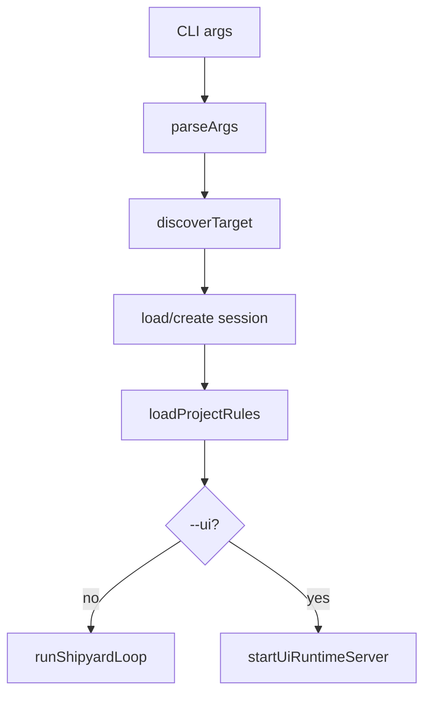

# CLI Entry

`src/bin/shipyard.ts` is the process entrypoint for Shipyard.

## Responsibilities

- parse `--target`, optional `--session`, and `--ui`
- create or resume session state
- run target discovery
- load target `AGENTS.md` rules into the injected context layer
- choose terminal REPL mode or browser runtime mode

## Do And Do Not

- Do keep startup and mode-selection logic here.
- Do not move shared instruction behavior into the CLI entrypoint.
- Do route behavior shared by terminal mode and UI mode through
  `src/engine/turn.ts`.

## Diagram

