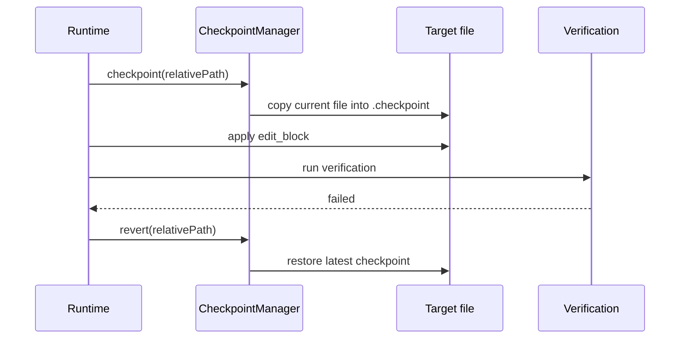

# Checkpoints

This subsystem snapshots files before Shipyard applies a surgical edit so the
runtime can recover from failed verification.

## Files

- `manager.ts`: creates sortable checkpoint files under
  `target/.shipyard/checkpoints/<sessionId>/` and restores the latest snapshot
  for a given relative path

## Behavior Notes

- Checkpoints are taken before `edit_block` writes.
- Filenames encode both time ordering and the target relative path.
- Recovery logic should treat checkpoints as per-session runtime state, not as
  a long-lived source artifact.

## Diagram

