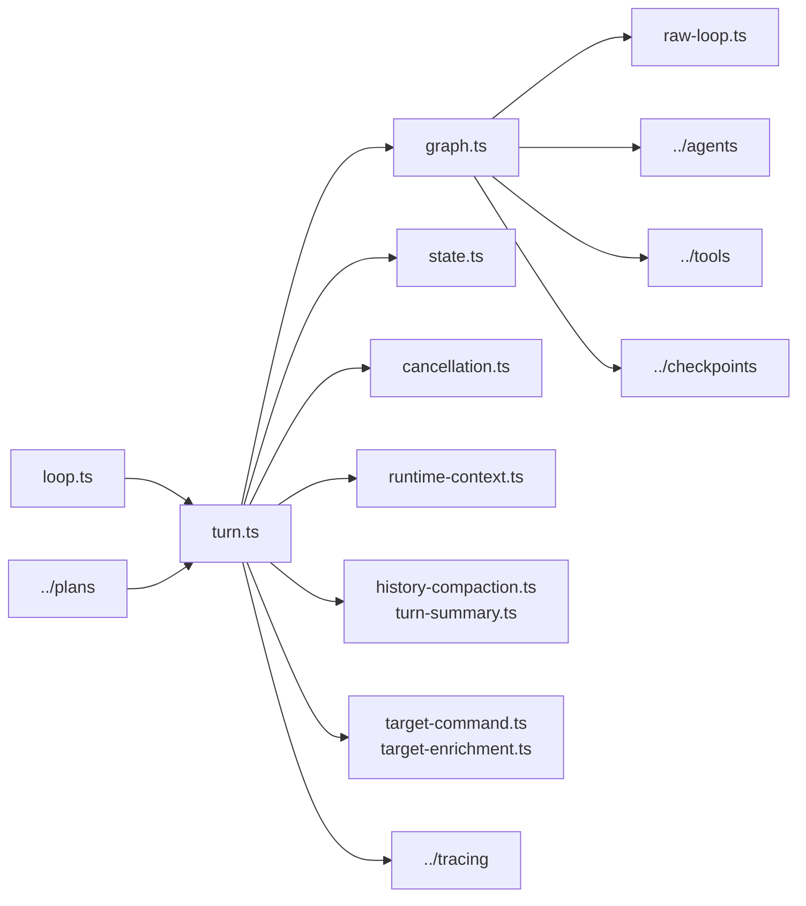

# Engine

`src/engine/` is the execution core for Shipyard's standard turns. Planning
turns live in `src/plans/`, but they eventually reuse this folder's shared turn
path for actual task execution.

## Key Files

- `loop.ts`: persistent terminal REPL, built-in utility commands, and routing
  for `plan:`, `next`, `continue`, and standard instructions
- `turn.ts`: shared standard-turn executor for code and target-manager phases;
  builds context, wires reporter callbacks, persists session state, and handles
  handoff load/emission
- `graph.ts`: explicit `plan -> act -> verify -> recover -> respond` state
  machine with explorer/planner/verifier/browser-evaluator hooks and raw
  fallback parity
- `raw-loop.ts`: lower-level model/tool loop used by the graph `act` node and
  helper subagents
- `model-adapter.ts`: provider-neutral internal model contract for turn
  messages, tool calls, and adapter boundaries
- `state.ts`: persisted session shape plus `.shipyard/` directory helpers
- `cancellation.ts`: active-turn cancellation normalization for terminal and UI
- `runtime-context.ts`: injected-context builders for project rules and
  target-manager instructions
- `history-compaction.ts` and `turn-summary.ts`: bounded history and summary
  helpers for long-running sessions
- `target-command.ts` and `target-enrichment.ts`: shared helpers for target
  switching and enrichment flows
- `anthropic.ts`: Anthropic client integration
- `live-verification.ts`: credentialed smoke helpers for end-to-end validation

## Ownership Rules

- If a behavior must work the same way in terminal and UI mode, put it here.
- Keep transport-specific logic out of this folder unless it directly affects
  runtime state or execution semantics.
- Prefer explicit runtime state over hidden module globals so sessions remain
  inspectable and serializable.
- Keep plan/task-queue orchestration in `src/plans/`; keep the actual standard
  execution contract here.

## Diagram

