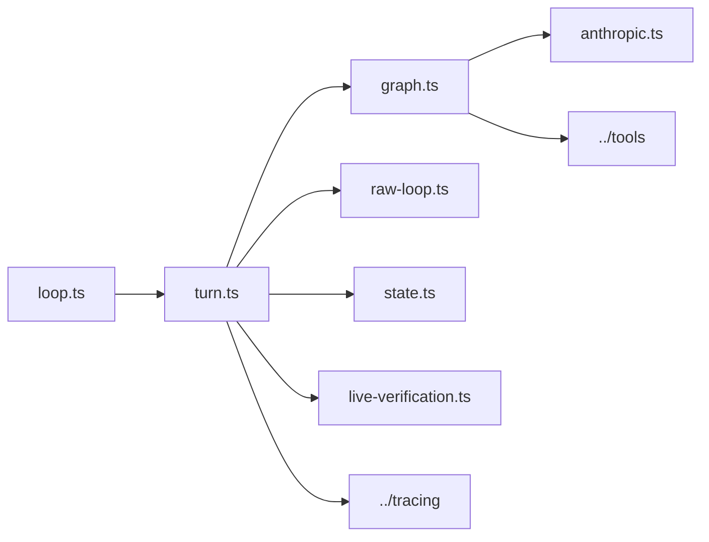

# Engine

`src/engine/` is the execution core shared by terminal mode and browser mode.

## Key Files

- `loop.ts`: persistent terminal REPL with built-in utility commands
- `turn.ts`: shared instruction executor that builds context, tracks runtime
  state, summarizes tool activity, and dispatches the phase runtime
- `graph.ts`: graph-style planning/acting/verifying/recovering/responding flow
  with a fallback escape hatch
- `raw-loop.ts`: lower-level tool loop used by the fallback path
- `state.ts`: persisted session shape plus `.shipyard` directory helpers
- `anthropic.ts`: Anthropic client integration
- `live-verification.ts`: real-model smoke helpers for end-to-end validation

## Ownership Rules

- If a behavior must work the same way in terminal and UI mode, put it here.
- Keep transport-specific logic out of this folder unless it directly affects
  runtime state or execution semantics.
- Prefer explicit runtime state over hidden module globals so sessions remain
  inspectable and serializable.

## Diagram

