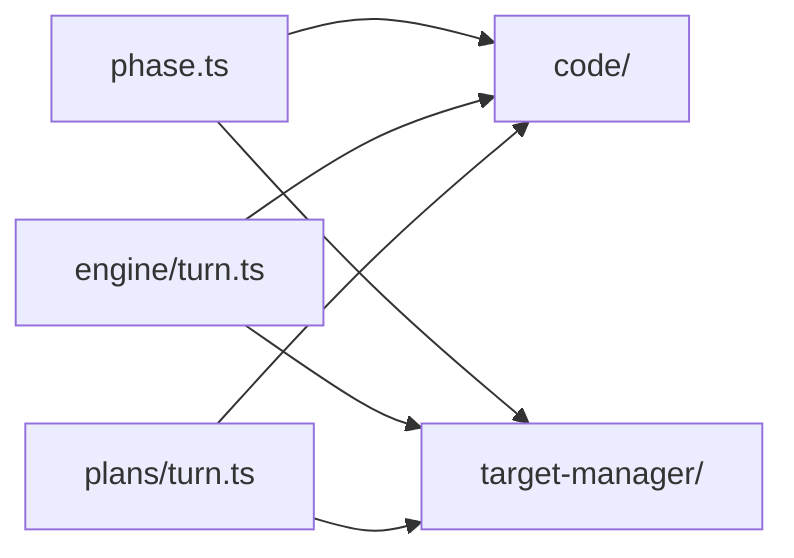

# Phases

Phases define how Shipyard bundles tools and prompts for a class of work.

## Files

- `phase.ts`: the shared phase contract
- `code/`: the default repository-change phase
- `target-manager/`: the pre-code phase for listing, selecting, creating, and
  enriching targets
- `../pipeline/`: the explicit multi-phase pipeline lane that reuses the phase
  artifact/gate vocabulary without routing every turn through it

## Current Shape

- `code` runs after a target has been selected. It exposes file/spec/search,
  bootstrap, edit, command, git-diff, and deploy tools, and returns a
  `task_plan` artifact.
- `target-manager` runs when Shipyard starts without `--target`. It exposes
  target catalog and enrichment tools and returns a `target_selection`
  artifact.
- Planning turns (`plan:`) reuse the current phase context to build a persisted
  task queue, but they do not execute a writing turn themselves.
- Pipeline turns (`pipeline ...`) are explicit and additive. They persist
  multi-phase run state, artifact approvals, and resume pointers under
  `.shipyard/pipelines/` while leaving normal direct turns unchanged.

If more phases are added later, keep them explicit and composable rather than
letting prompt text or tool choices drift across unrelated folders.

## Diagram

