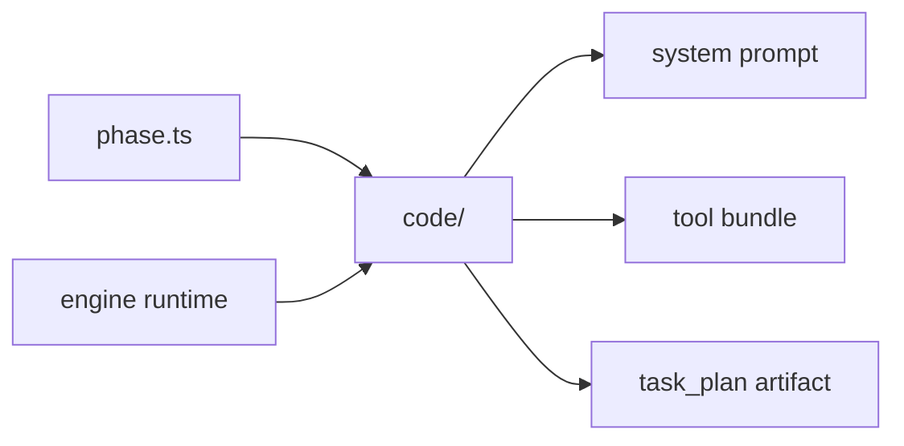

# Phases

Phases define how Shipyard bundles tools and prompts for a class of work.

## Files

- `phase.ts`: the phase contract
- `code/`: the current default coding phase, including prompt text and the tool
  bundle exposed to the model

See [`code/README.md`](./code/README.md) for the phase-local guide.

## Current Shape

The repository is currently centered on a single code phase. That phase exposes
the read, write, edit, list, search, command, and git diff tools and returns a
task plan artifact.

If more phases are added later, keep them explicit and composable rather than
letting prompt text or tool choices drift across unrelated folders.

## Diagram

