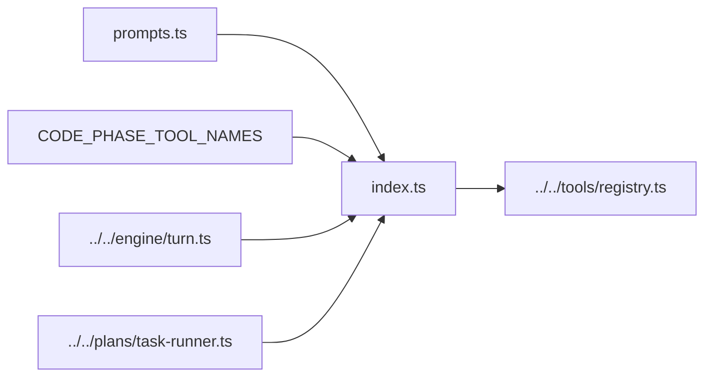

# Code Phase

This is Shipyard's default phase for repository changes after a concrete target
has been selected.

## Files

- `index.ts`: exports the phase definition, the enabled tool names, and helper
  functions for retrieving tool definitions in runtime-specific formats
- `prompts.ts`: the system prompt used for standard code turns

## Responsibilities

- expose the bounded code-phase tool surface:
  `read_file`, `load_spec`, `write_file`, `bootstrap_target`, `edit_block`,
  `list_files`, `search_files`, `run_command`, `git_diff`, and `deploy_target`
- describe the standard output artifact as a `task_plan`
- keep default planning/editing guidance in one place
- support both direct code turns and queued task execution from `next` /
  `continue`

Planner-backed `ExecutionSpec` generation is a helper-agent concern rather than
the phase output itself; the code phase still returns the coordinator's
lightweight `task_plan` artifact to the outer runtime.

## Diagram

