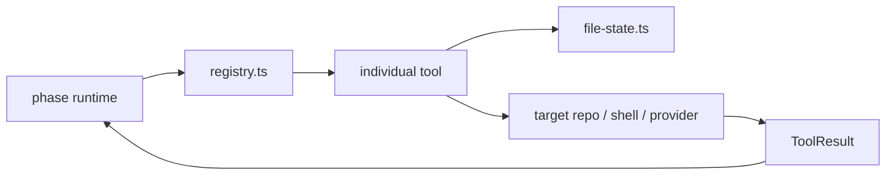

# Tools

This folder contains the model-facing capability surface for Shipyard.

## Current Tools

Code-phase tools:

- `read-file.ts` -> `read_file`
- `load-spec.ts` -> `load_spec`
- `write-file.ts` -> `write_file`
- `edit-block.ts` -> `edit_block`
- `list-files.ts` -> `list_files`
- `search-files.ts` -> `search_files`
- `run-command.ts` -> `run_command`
- `git-diff.ts` -> `git_diff`
- `deploy.ts` -> `deploy_target`
- `target-manager/bootstrap-target.ts` -> `bootstrap_target`

Target-manager tools:

- `target-manager/list-targets.ts` -> `list_targets`
- `target-manager/select-target.ts` -> `select_target`
- `target-manager/create-target.ts` -> `create_target`
- `target-manager/enrich-target.ts` -> `enrich_target`

Supporting files:

- `registry.ts`: tool registration, lookup, and Anthropic tool-shape export
- `file-state.ts`: path normalization and hash tracking for safe edits
- `target-manager/profile-io.ts`: target profile persistence helpers
- `target-manager/scaffolds.ts` and `target-manager/scaffold-materializer.ts`:
  shared scaffold presets used by both `create_target` and `bootstrap_target`
- `index.ts`: side-effect imports that register tools plus the public exports

## Authoring Rules

- Keep tool inputs typed and JSON-schema describable.
- Normalize and validate all target-relative paths before touching disk.
- Return structured success or error results instead of throwing unstructured
  text at the runtime.
- Prefer small, deterministic tools that compose cleanly inside the phase
  runtime over large tools that try to handle multiple jobs at once.
- If a new capability belongs only to one phase, register it globally but
  expose it only through that phase's tool list.

## Diagram

