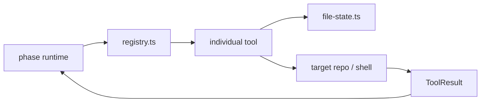

# Tools

This folder contains the model-facing capability surface for Shipyard.

## Current Tools

- `read-file.ts`
- `load-spec.ts`
- `write-file.ts`
- `edit-block.ts`
- `list-files.ts`
- `search-files.ts`
- `run-command.ts`
- `git-diff.ts`

Supporting files:

- `registry.ts`: tool registration, lookup, and Anthropic tool-shape export
- `file-state.ts`: path normalization and hash tracking for safe edits
- `index.ts`: side-effect imports that register tools plus the public exports

## Authoring Rules

- Keep tool inputs typed and JSON-schema describable.
- Normalize and validate all target-relative paths before touching disk.
- Return structured success or error results instead of throwing unstructured
  text at the runtime.
- Prefer small, deterministic tools that compose cleanly inside the phase
  runtime over large tools that try to handle multiple jobs at once.

## Diagram

