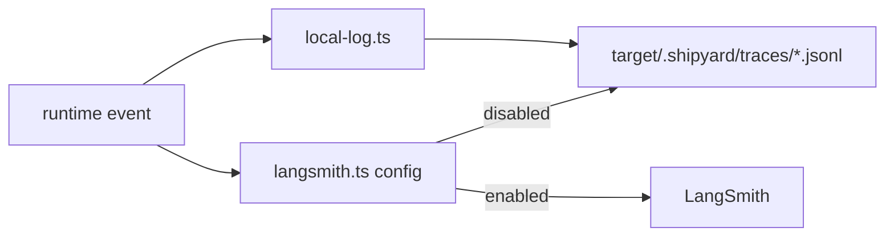

# Tracing

Shipyard records runtime activity locally by default and can attach LangSmith
when credentials are configured.

## Files

- `local-log.ts`: JSONL trace writer under `target/.shipyard/traces/`
- `langsmith.ts`: environment parsing, client creation, callback wiring, and
  trace URL resolution

## Operating Model

- Local traces should always be available, even when remote tracing is not.
- LangSmith is opt-in and should activate only when the required environment
  variables are present.
- Runtime code should pass structured metadata into tracing helpers instead of
  formatting opaque strings as late as possible.

## Diagram

