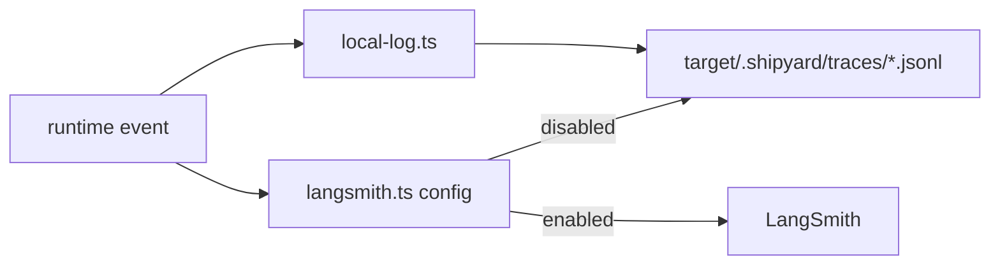

# Tracing

Shipyard records runtime activity locally by default and can attach LangSmith
when credentials are configured.

## Files

- `local-log.ts`: JSONL trace writer under `target/.shipyard/traces/`
- `langsmith.ts`: environment parsing, client creation, callback wiring, and
  trace URL resolution

## Operating Model

- Local traces should always be available, even when remote tracing is not.
- LangSmith is opt-in and should activate only when the required environment
  variables are present.
- Runtime code should pass structured metadata into tracing helpers instead of
  formatting opaque strings as late as possible.
- Final LangSmith metadata should be attached before the trace wrapper patches
  the run; late `updateRun` calls are not reliable once payload ingestion has
  already finished.
- Long-run reset stories should record structured handoff facts in both local
  logs and remote metadata, not bury them in free-form summary text.
- Trace URL lookup is best-effort. If LangSmith has not indexed the run URL
  yet, Shipyard should keep the turn successful and return the root `runId`
  plus any available project link instead of failing the runtime path.

## Current Handoff Fields

- Local `instruction.plan` JSONL events can include a `handoff` payload with
  loaded, emitted, and load-error state.
- Local `instruction.plan` JSONL events now also include a `harnessRoute`
  payload with the selected lightweight vs planner-backed path, verifier mode,
  browser-evaluator usage, and reset reason.
- Local `instruction.plan` JSONL events can also include an
  `executionFingerprint` plus `executionFingerprintLabel` so the surface,
  planning mode, preview state, browser-evaluator usage, and resolved model are
  easy to compare across CLI and browser runs.
- LangSmith trace metadata currently records `handoffLoaded`, `handoffPath`,
  `handoffReason`, `selectedPath`, `verificationMode`, browser-evaluator
  usage, and the per-turn execution fingerprint so routing is visible without
  opening raw prompts.
- Turn-level LangSmith traces now return the root turn run reference, while the
  nested runtime trace continues to capture graph-specific details underneath it.

## Operational Verification

- Finish relevant stories with the LangSmith CLI, not just the local JSONL log.
- Shipyard runtime accepts both `LANGCHAIN_*` and `LANGSMITH_*` env aliases, but
  the CLI reads `LANGSMITH_*` names unless flags are passed explicitly.
- Before CLI verification, normalize the env in your shell if needed:
  - `export LANGCHAIN_TRACING_V2="${LANGCHAIN_TRACING_V2:-true}"`
  - `export LANGSMITH_TRACING="${LANGSMITH_TRACING:-$LANGCHAIN_TRACING_V2}"`
  - `export LANGSMITH_API_KEY="${LANGSMITH_API_KEY:-$LANGCHAIN_API_KEY}"`
  - `export LANGSMITH_PROJECT="${LANGSMITH_PROJECT:-$LANGCHAIN_PROJECT}"`
  - `export LANGSMITH_ENDPOINT="${LANGSMITH_ENDPOINT:-$LANGCHAIN_ENDPOINT}"`
- Typical finish-stage checks:
  - `pnpm --dir shipyard exec langsmith trace list --project "$LANGSMITH_PROJECT" --last-n-minutes 30 --limit 5 --full`
  - `pnpm --dir shipyard exec langsmith run list --project "$LANGSMITH_PROJECT" --last-n-minutes 30 --error --limit 10 --full`
  - `pnpm --dir shipyard exec langsmith insights list --project "$LANGSMITH_PROJECT" --limit 3`

## Diagram

