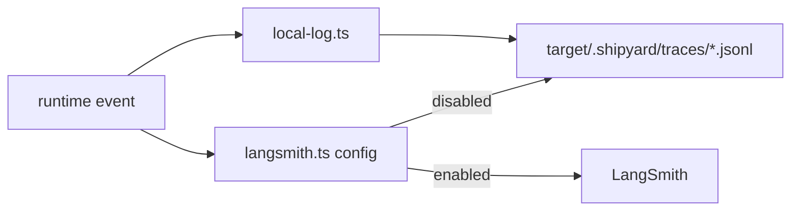

# Tracing

Shipyard records runtime activity locally by default and can attach LangSmith
when credentials are configured.

## Files

- `local-log.ts`: JSONL trace writer under `target/.shipyard/traces/`
- `langsmith.ts`: environment parsing, client creation, callback wiring, and
  trace URL resolution

## Operating Model

- Local traces should always be available, even when remote tracing is not.
- LangSmith is opt-in and should activate only when the required environment
  variables are present.
- Runtime code should pass structured metadata into tracing helpers instead of
  formatting opaque strings as late as possible.

## Operational Verification

- Finish relevant stories with the LangSmith CLI, not just the local JSONL log.
- Shipyard runtime accepts both `LANGCHAIN_*` and `LANGSMITH_*` env aliases, but
  the CLI reads `LANGSMITH_*` names unless flags are passed explicitly.
- Before CLI verification, normalize the env in your shell if needed:
  - `export LANGCHAIN_TRACING_V2="${LANGCHAIN_TRACING_V2:-true}"`
  - `export LANGSMITH_TRACING="${LANGSMITH_TRACING:-$LANGCHAIN_TRACING_V2}"`
  - `export LANGSMITH_API_KEY="${LANGSMITH_API_KEY:-$LANGCHAIN_API_KEY}"`
  - `export LANGSMITH_PROJECT="${LANGSMITH_PROJECT:-$LANGCHAIN_PROJECT}"`
  - `export LANGSMITH_ENDPOINT="${LANGSMITH_ENDPOINT:-$LANGCHAIN_ENDPOINT}"`
- Typical finish-stage checks:
  - `pnpm --dir shipyard exec langsmith trace list --project "$LANGSMITH_PROJECT" --last-n-minutes 30 --limit 5 --full`
  - `pnpm --dir shipyard exec langsmith run list --project "$LANGSMITH_PROJECT" --last-n-minutes 30 --error --limit 10 --full`
  - `pnpm --dir shipyard exec langsmith insights list --project "$LANGSMITH_PROJECT" --limit 3`

## Diagram

