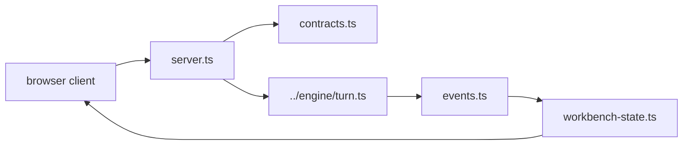

# UI Backend

This folder is the backend half of Shipyard's browser runtime. The React app
itself lives in `../../ui/`.

## Files

- `server.ts`: local HTTP and WebSocket runtime for `--ui`
- `contracts.ts`: typed frontend/backend message protocol, including stepwise
  tool detail, immediate edit preview, and trace-link fields
- `events.ts`: translation layer from engine events into browser-safe messages
- `workbench-state.ts`: session-backed browser state model, reducers, and turn
  queueing helpers

## Runtime Boundary

- `src/ui/` serves and coordinates the browser session.
- `ui/` renders the operator interface.
- `src/engine/turn.ts` remains the shared execution path for both terminal and
  browser mode.
- The browser contract should surface tool progress incrementally instead of
  reconstructing every change only after `done`.

When adding browser features, keep that split intact so UI transport concerns do
not leak into the core runtime.

## Diagram

