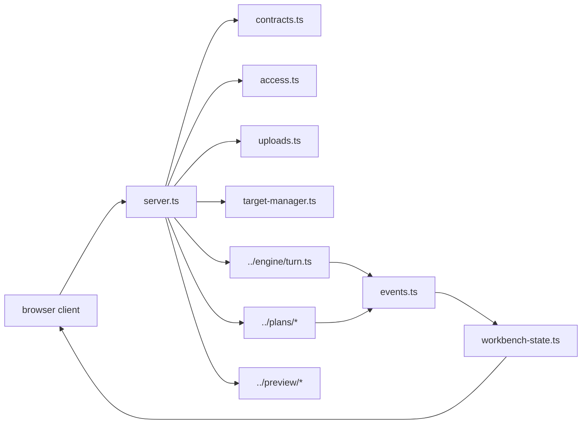

# UI Backend

This folder is the backend half of Shipyard's browser runtime. The React app
itself lives in `../../ui/`.

## Files

- `server.ts`: local HTTP and WebSocket runtime for `--ui`; owns session resume,
  turn routing, preview-state publishing, deploy summaries, and target-manager
  actions
- `contracts.ts`: typed frontend/backend message protocol, including session
  state, turn events, file events, target-manager state, uploads, preview, and
  deploy fields
- `events.ts`: translation layer from engine reporter events into browser-safe
  incremental messages
- `workbench-state.ts`: session-backed browser state model and reducers for
  turns, file events, upload receipts, preview state, and deploy state
- `target-manager.ts`: server-side shaping for current-target, available-target,
  and enrichment-status view models
- `uploads.ts`: browser attachment intake, bounded preview generation, and
  stored-receipt helpers
- `access.ts`: hosted access-token cookie flow and request guards

## Runtime Boundary

- `src/ui/` serves and coordinates the browser session.
- `ui/` renders the operator interface.
- Standard instructions route through `src/engine/turn.ts`.
- Planning turns route through `src/plans/turn.ts` and
  `src/plans/task-runner.ts`.
- Preview supervision, upload storage, target switching, and deploy summaries
  are backend concerns; the frontend consumes typed summaries rather than
  rebuilding state from raw logs.

## Diagram

