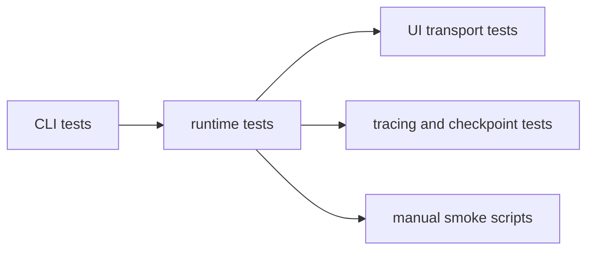

# Tests

The automated suite lives here alongside a small set of manual smoke scripts.

## Automated Coverage

The Vitest suite exercises the main runtime boundaries:

- CLI loop persistence and session behavior
- discovery and context envelope shaping
- tool registration and tool execution contracts
- graph runtime and shared turn execution
- UI event mapping, browser runtime transport, and frontend view models
- tracing and checkpointing behavior

`vitest.config.ts` keeps file-level parallelism off so the integration-style
tests remain deterministic.

## Manual Smoke Scripts

`tests/manual/` holds opt-in scripts for higher-friction verification such as
live model loops or tracing checks that depend on local credentials.

See [`manual/README.md`](./manual/README.md) for the current script map.

## Test Writing Guidance

- Prefer tests that exercise the nearest stable boundary rather than asserting
  against internal implementation details.
- Add or update automated coverage when a change affects session state, tool
  contracts, CLI behavior, or browser runtime messaging.

## Diagram

