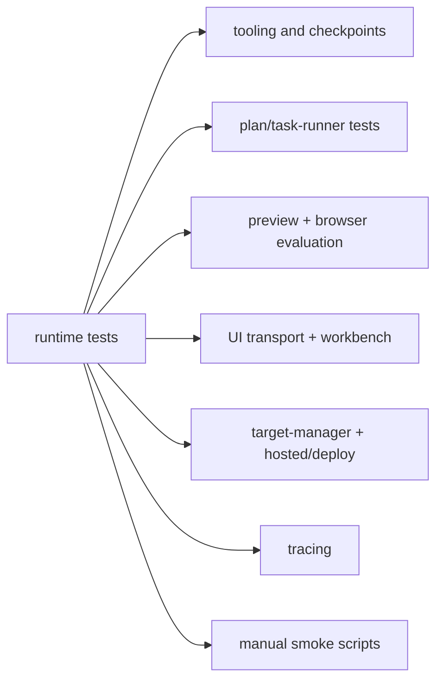

# Tests

The automated suite lives here alongside a small set of manual smoke scripts.

## Automated Coverage

The Vitest suite exercises the main runtime boundaries:

- runtime core: `cli-loop`, `loop-runtime`, `turn-runtime`, `raw-loop`,
  `graph-runtime`, `anthropic-contract`, and `live-verification`
- tool and edit safety: `tooling`, `checkpoint-manager`, `spec-loader`, and
  `scaffold-bootstrap`
- repo understanding and context shaping: `discovery` and `context-envelope`
- helper agents and routed planning: `explorer-subagent`, `planner-subagent`,
  `verifier-subagent`, `plan-mode`, `task-runner`, `handoff-artifacts`, and
  `evaluator-calibration`
- preview and browser evaluation: `preview-supervisor` and `browser-evaluator`
- browser backend and workbench state: `ui-runtime`, `ui-events`,
  `ui-view-models`, `ui-socket-manager`, `ui-workbench`, `ui-chat-workspace`,
  `ui-activity-diff`, `ui-context-ui`, and `session-history`
- target-manager, enrichment, and hosted/deploy surfaces: `target-manager`,
  `target-auto-enrichment`, `ui-access`, and `railway-config`
- tracing: `langsmith-tracing`

`vitest.config.ts` keeps file-level parallelism off so the integration-style
tests remain deterministic.

## Focused Suites By Surface

- `tests/graph-runtime.test.ts`: graph-node routing, fallback parity, recovery,
  and verification behavior
- `tests/planner-subagent.test.ts`,
  `tests/explorer-subagent.test.ts`, and
  `tests/verifier-subagent.test.ts`: helper-agent contracts and validation
- `tests/plan-mode.test.ts` and `tests/task-runner.test.ts`: `plan:`, `next`,
  `continue`, active-task state, and persisted queue behavior
- `tests/browser-evaluator.test.ts`: loopback preview inspection, console
  checks, selector waits, and artifact capture
- `tests/target-manager.test.ts` and
  `tests/target-auto-enrichment.test.ts`: target selection, creation, profile
  shaping, and enrichment
- `tests/ui-runtime.test.ts`: end-to-end browser-runtime transport, saved-run
  resume, uploads, deploy status, and reconnect behavior
- `tests/ui-workbench.test.ts`, `tests/ui-chat-workspace.test.ts`,
  `tests/ui-activity-diff.test.ts`, and `tests/ui-context-ui.test.ts`: current
  shell and panel rendering

## Manual Smoke Scripts

`tests/manual/` holds opt-in scripts for higher-friction verification such as
live model loops or tracing checks that depend on local credentials.

Current scripts:

- `phase2-tools-smoke.ts`
- `phase3-live-loop-smoke.ts`
- `phase4-langsmith-mvp.ts`
- `phase5-local-preview-smoke.ts`

See [`manual/README.md`](./manual/README.md) for the current script map.

## Test Writing Guidance

- Prefer tests that exercise the nearest stable boundary rather than asserting
  against internal implementation details.
- Add or update automated coverage when a change affects session state, plan
  queues, tool contracts, CLI behavior, browser runtime messaging, or deploy
  flows.
- When documenting a UI behavior, check the current workbench shell before
  reusing older panel terminology from historic phases.

## Diagram

