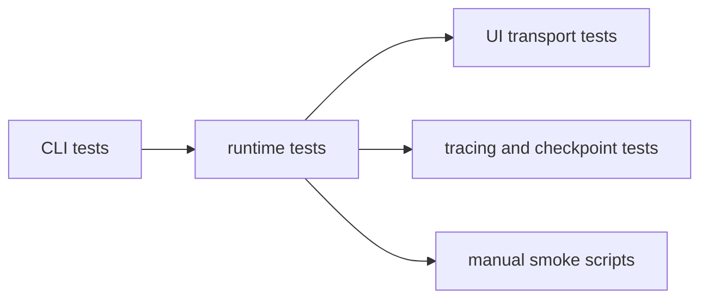

# Tests

The automated suite lives here alongside a small set of manual smoke scripts.

## Automated Coverage

The Vitest suite exercises the main runtime boundaries:

- CLI loop persistence and session behavior
- discovery and context envelope shaping
- tool registration and tool execution contracts
- graph runtime and shared turn execution
- session-history summaries plus UI event mapping, browser runtime transport,
  and frontend view models
- tracing and checkpointing behavior

`vitest.config.ts` keeps file-level parallelism off so the integration-style
tests remain deterministic.

## SV-S01 Smoke Matrix

`pnpm --dir shipyard test:smoke` reruns the requirement-driven MVP matrix added
for `SV-S01`.

| Requirement | Smoke coverage | Stress or failure coverage |
|---|---|---|
| Persistent loop and session resume | `tests/cli-loop.test.ts` proves repeated turns, interleaved `status`, and explicit exit in one process. | `tests/cli-loop.test.ts` also covers restart plus `--session` resume with persisted turn count after a failed turn. |
| Surgical file editing guardrails | `tests/tooling.test.ts` covers successful unique-anchor edits. | `tests/tooling.test.ts` now also covers repeated edits to one file, stale reads, ambiguous anchors, missing anchors, and large rewrite rejection. |
| Context injection and rolling history | `tests/context-envelope.test.ts` validates serialized prompt sections and injected context placement. | `tests/turn-runtime.test.ts` exercises multi-turn carry-forward, current-turn context injection, and the eight-line rolling summary bound. |
| Browser UI operator flow | `tests/ui-runtime.test.ts` covers instruction submission, streamed tool activity, preview auto-start, refresh-state streaming, edit previews, reconnect snapshots, saved-run browsing, and session resume. | `tests/ui-runtime.test.ts` also covers error recovery and repeated error-stream runs for stability. |
| Preview supervision | `tests/discovery.test.ts` and `tests/preview-supervisor.test.ts` cover preview capability inference plus start, refresh, exit, and startup-failure states. | `tests/ui-runtime.test.ts` verifies preview lifecycle messages remain aligned with the browser session contract. |
| Trace evidence | `tests/ui-runtime.test.ts` checks local JSONL trace entries for success and failure instructions. | `tests/graph-runtime.test.ts` verifies graph-success and fallback-failure paths both attach LangSmith trace metadata when tracing is enabled. |

`tests/session-history.test.ts` is the focused unit suite for persisted saved-run
ordering and per-run preview metadata.

## Manual Smoke Scripts

`tests/manual/` holds opt-in scripts for higher-friction verification such as
live model loops or tracing checks that depend on local credentials.

See [`manual/README.md`](./manual/README.md) for the current script map.

## Test Writing Guidance

- Prefer tests that exercise the nearest stable boundary rather than asserting
  against internal implementation details.
- Add or update automated coverage when a change affects session state, tool
  contracts, CLI behavior, or browser runtime messaging.

## Diagram

