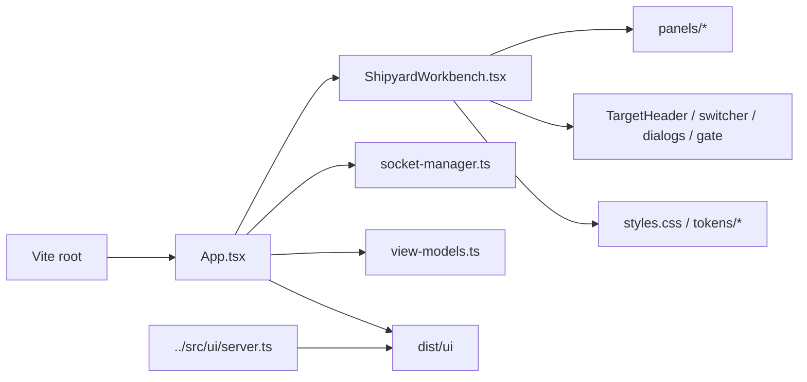

# UI Frontend

`ui/` contains the React and Vite frontend for Shipyard's browser workbench.

## Key Files

- `src/main.tsx`: frontend bootstrap
- `src/App.tsx`: hosted-access bootstrap, upload handling, socket lifecycle,
  transport state, and workbench state orchestration
- `src/ShipyardWorkbench.tsx`: current split-pane shell composition
- `src/TargetHeader.tsx`, `src/TargetSwitcher.tsx`,
  `src/TargetCreationDialog.tsx`, `src/EnrichmentIndicator.tsx`,
  `src/HostedAccessGate.tsx`: target-manager, deploy-status, and hosted-access
  surfaces
- `src/panels/*`: transcript, composer, file diff, output, session, run
  history, and context panels
- `src/socket-manager.ts`: reconnecting WebSocket transport manager
- `src/view-models.ts`, `src/context-ui.ts`, and `src/activity-diff.ts`:
  frontend state shaping and UI helpers
- `src/styles.css` and `src/tokens/*`: styling and design tokens
- `index.html`: Vite entry document

## Workbench Highlights

- The header strip surfaces workspace identity, trace-copy, and refresh
  controls.
- The target header shows the active target, enrichment status, deploy
  readiness, publish errors, and the latest production URL when available.
- The left pane keeps the latest conversation and composer together.
- The right pane focuses on file-level diff evidence and command output rather
  than a dedicated preview/live-view tab set.
- The drawer holds session details, saved runs, and injected context history.
- Hosted sessions can require a shared access token before the workbench unlocks.
- Upload receipts flow through the same workbench state as turns and context
  history.

## Build Contract

- Vite uses `ui/` as the frontend root.
- Production assets build into `dist/ui`.
- The backend server in `src/ui/server.ts` serves the built shell when present
  and falls back to a simple contract view when it is not.

See [`src/README.md`](./src/README.md) for the source-level guide.

## Diagram

