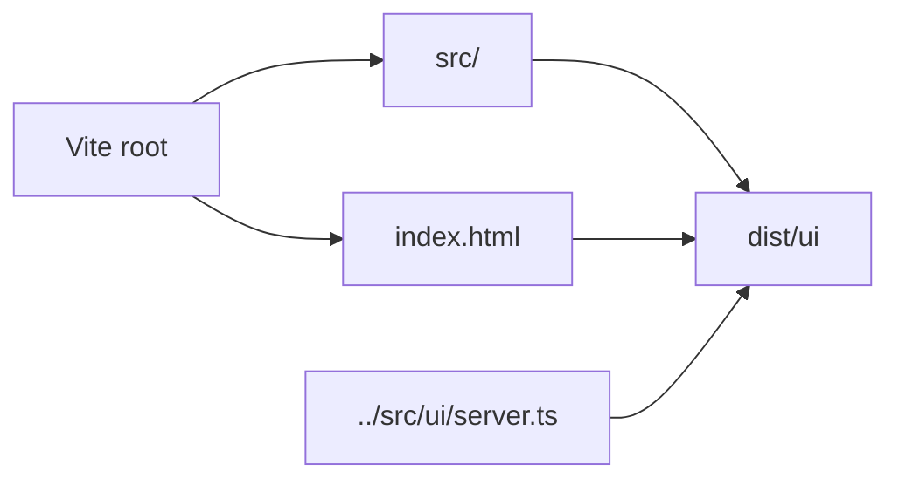

# UI Frontend

`ui/` contains the React and Vite frontend for Shipyard's browser workbench.

## Key Files

- `src/main.tsx`: frontend bootstrap
- `src/App.tsx`: app root
- `src/ShipyardWorkbench.tsx`: main workbench composition
- `src/view-models.ts`: frontend-side view shaping
- `src/primitives.tsx`: shared UI primitives
- `src/styles.css` and `src/tokens.css`: styling and design tokens
- `index.html`: Vite entry document

## Build Contract

- Vite uses `ui/` as the frontend root.
- Production assets build into `dist/ui`.
- The backend server in `src/ui/server.ts` serves the built shell when present
  and falls back to a simple contract view when it is not.

See [`src/README.md`](./src/README.md) for the source-level guide.

## Diagram

