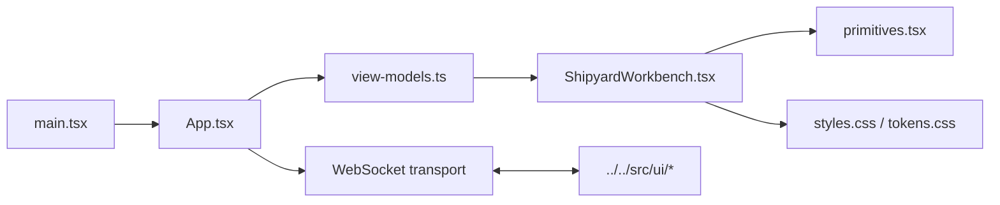

# UI Source

`ui/src/` contains the React entrypoint and presentation-layer source for the
Shipyard browser workbench.

## Files

- `main.tsx`: bootstraps React into the Vite root element
- `App.tsx`: manages the WebSocket lifecycle, transport state, and instruction
  submission flow
- `ShipyardWorkbench.tsx`: renders the operator-facing workbench UI
- `view-models.ts`: re-exports the shared workbench view-model helpers from the
  backend-side UI module
- `primitives.tsx`: local UI primitives
- `styles.css` and `tokens.css`: visual system and styling tokens
- `vite-env.d.ts`: Vite typing support

## Diagram

