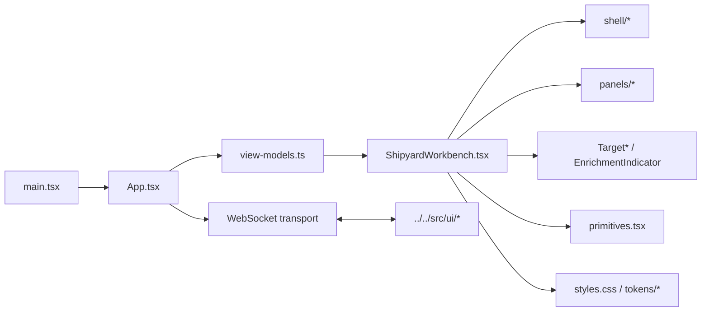

# UI Source

`ui/src/` contains the React entrypoint and presentation-layer source for the
Shipyard browser workbench.

## Files

- `main.tsx`: bootstraps React into the Vite root element
- `App.tsx`: manages the WebSocket lifecycle, transport state, and instruction
  submission flow
- `ShipyardWorkbench.tsx`: composes the shell, panels, and target-manager
  overlays into the operator-facing workbench
- `view-models.ts`: re-exports the shared workbench view-model helpers from the
  backend-side UI module
- `primitives.tsx`: local UI primitives
- `shell/`: shell layout, header strip, sidebars, and footer
- `panels/`: composer, activity, session, saved-run history, context, and file
  panels
- `TargetHeader.tsx`, `TargetSwitcher.tsx`, `TargetCreationDialog.tsx`,
  `EnrichmentIndicator.tsx`: target-manager browser controls
- `styles.css` and `tokens/`: visual system and styling tokens
- `vite-env.d.ts`: Vite typing support

## Current Browser Behaviors

- `App.tsx` sends `session:resume_request` messages so the browser can reopen a
  saved run without restarting the Shipyard process.
- `panels/ActivityFeed.tsx` renders grouped activity blocks with `Latest run`
  and `All runs` scope controls.
- `panels/RunHistoryPanel.tsx` lists saved sessions for the active target and
  surfaces a resume action for any non-current run.

## Diagram

