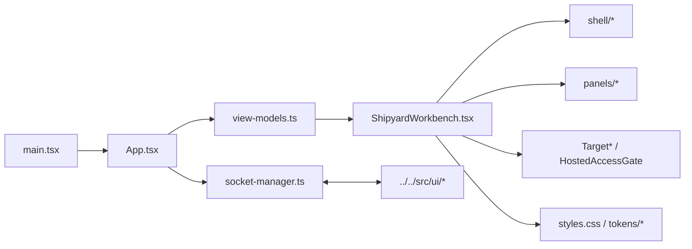

# UI Source

`ui/src/` contains the React entrypoint and presentation-layer source for the
Shipyard browser workbench.

## Files

- `main.tsx`: bootstraps React into the Vite root element
- `App.tsx`: manages hosted-access bootstrap, upload flows, WebSocket lifecycle,
  transport state, and workbench-state updates
- `ShipyardWorkbench.tsx`: composes the current split-pane shell, drawer, and
  target-manager chrome
- `socket-manager.ts`: reconnecting WebSocket wrapper used by `App.tsx`
- `view-models.ts`: frontend-facing state helpers that shape backend messages
  into the workbench model
- `context-ui.ts` and `activity-diff.ts`: context-draft and diff helpers
- `primitives.tsx`: local UI primitives
- `shell/`: header strip, shell layout, icon rail, sidebars, and footer pieces
- `panels/`: chat, composer, file, output, session, run-history, and context
  panels; it also retains reusable preview/live-view components for future
  compositions
- `TargetHeader.tsx`, `TargetSwitcher.tsx`, `TargetCreationDialog.tsx`,
  `EnrichmentIndicator.tsx`, `HostedAccessGate.tsx`: target-manager, deploy,
  and hosted-access UI
- `styles.css`, `components.css`, and `tokens/`: visual system and styling
  tokens
- `vite-env.d.ts`: Vite typing support

## Current Browser Behaviors

- `App.tsx` sanitizes bootstrap `access_token` query params, negotiates
  `/api/access`, and shows `HostedAccessGate` when the hosted runtime requires
  it.
- `App.tsx` also branches between the full workbench shell and the dedicated
  `/human-feedback` route while keeping the same hosted-access gate, socket
  lifecycle, and instruction submission path.
- `App.tsx` sends `session:resume_request` messages so the browser can reopen a
  saved run without restarting the Shipyard process.
- `socket-manager.ts` retries disconnected sessions and blocks sends while the
  transport is unavailable.
- `ShipyardWorkbench.tsx` renders target/deploy status at the top, the
  transcript plus composer on the left, and file/output evidence on the right.
- `HumanFeedbackPage.tsx` exposes a focused textarea-only surface for feeding
  the running ultimate loop from the human side while reusing the same
  websocket `instruction` transport.
- File attachments go through `/api/uploads`, then appear as bounded receipts in
  workbench state and the next-turn context preview.
- `TargetSwitcher.tsx` and `TargetCreationDialog.tsx` drive target selection and
  scaffold creation without leaving the active session.

## Diagram

