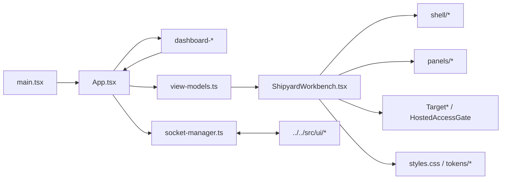

# UI Source

`ui/src/` contains the React entrypoint and presentation-layer source for the
Shipyard browser workbench.

## Files

- `main.tsx`: bootstraps React into the Vite root element
- `App.tsx`: thin route shell that composes dashboard/editor/board surfaces,
  dashboard launch intent handling, and hosted-access gating on top of the
  shared controller
- `dashboard-catalog.ts`, `dashboard-preferences.ts`, and
  `dashboard-launch.ts`: dashboard projection, local browser preferences, and
  request-correlated launch helpers
- `board-view-model.ts`, `board-preferences.ts`, and
  `dashboard-system-notice.ts`: board projection, board filter persistence, and
  route-level reconnect/error notices
- `target-selection.ts`: shared selected-target helpers used by dashboard,
  editor-route, and board-route selectors
- `ShipyardWorkbench.tsx`: composes the current split-pane shell, drawer, and
  target-manager chrome
- `socket-manager.ts`: reconnecting WebSocket wrapper used by `App.tsx`
- `view-models.ts`: frontend-facing state helpers that shape backend messages
  into the workbench model
- `context-ui.ts` and `activity-diff.ts`: context-draft and diff helpers
- `primitives.tsx`: local UI primitives
- `shell/`: header strip, shell layout, icon rail, sidebars, and footer pieces
- `panels/`: chat, composer, file, output, session, run-history, and context
  panels; it also retains reusable preview/live-view components for future
  compositions
- `TargetHeader.tsx`, `TargetSwitcher.tsx`, `TargetCreationDialog.tsx`,
  `EnrichmentIndicator.tsx`, `HostedAccessGate.tsx`: target-manager, deploy,
  and hosted-access UI
- `styles.css`, `components.css`, and `tokens/`: visual system and styling
  tokens
- `vite-env.d.ts`: Vite typing support

## Current Browser Behaviors

- `App.tsx` sanitizes bootstrap `access_token` query params, negotiates
  `/api/access`, and shows `HostedAccessGate` when the hosted runtime requires
  it.
- The dashboard route now renders the live product catalog, persists recent and
  starred preferences in browser storage, and stages hero-prompt launches into
  the editor with request correlation instead of timing-based follow behavior.
- `App.tsx` also branches between the live dashboard, full workbench shell,
  live board route, and dedicated `/human-feedback` surface while keeping the
  same hosted-access gate, socket lifecycle, and instruction submission path.
- The board route is project-scoped at `#/board/<productId>`, consumes the
  runtime `taskBoard` snapshot only after that product is resolved against live
  session state, preserves the selected story filter per product in browser
  storage, and renders explicit missing-target, loading, stale, and empty
  states instead of mock fallbacks.
- `App.tsx` sends `session:resume_request` messages so the browser can reopen a
  saved run without restarting the Shipyard process.
- `socket-manager.ts` retries disconnected sessions and blocks sends while the
  transport is unavailable.
- `ShipyardWorkbench.tsx` renders target/deploy status at the top, the
  transcript plus composer on the left, and file/output evidence on the right.
- `HumanFeedbackPage.tsx` exposes a focused textarea-only surface for feeding
  the running ultimate loop from the human side while reusing the same
  websocket `instruction` transport and surfacing explicit no-session and
  reconnect guidance when feedback cannot be sent yet.
- File attachments go through `/api/uploads`, then appear as bounded receipts in
  workbench state and the next-turn context preview.
- `TargetSwitcher.tsx` and `TargetCreationDialog.tsx` drive target selection and
  scaffold creation without leaving the active session, and the dashboard now
  reuses the creation dialog for its new-product card.
- `HostedAccessGate.tsx` now exposes explicit checking and unlocking states
  instead of relying on button copy alone, while still keeping the shared token
  out of stored artifacts.

## Diagram

